# Lab 1 - Build a presentation from start to finish with Copilot in PowerPoint

### Lab Overview

Imagine you're a marketing manager at a company called Contoso. Your team is preparing for an important client meeting where you need to present the company's strategy for a new Chai Tea product line to be sold in Latin America Your goal is to create a compelling presentation that highlights the product's features, benefits, and use cases, while ensuring it adheres to the company's branding standards. You've already developed a business plan for this product, and want to use that content when preparing for your meeting. You need to collaborate with your team and get the presentation reviewed by your manager before the meeting.

By the end of this Lab, you'll be able to create a new presentation, based on a Word document, insert an image, edit text, organize the presentation, incorporate corporate branding standards, and send the draft presentation to your manager for review using Copilot in PowerPoint.

### Lab prerequisites

Throughout this Lab, we'll craft prompts for Microsoft 365 Copilot that reference this file. You should have already uploaded it to OneDrive during the lab setup process, but if you need to download it again, you can do so here and upload in to one drive.

1. In the Lab VM, open a web browser, right click on the following link [Promotion Plan for Chai Tea in Latin America.docx](https://go.microsoft.com/fwlink/?linkid=2269126) then **Copy link** and then paste it on the browser tab to download the word file.

1. Select **Download file**.

    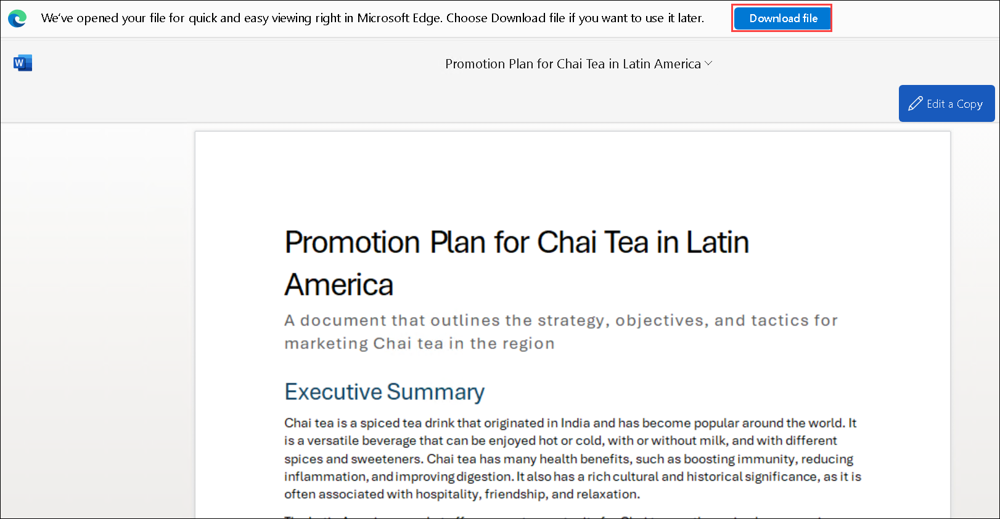

1. Right click on the following link, [M365 Copilot](https://m365.cloud.microsoft/apps/?auth=2) then **Copy link** and then paste it on the browser tab to navigate to the **M365 Copilot**.

1. Select **Apps (1)** and then select **Onedrive (2)**.   

    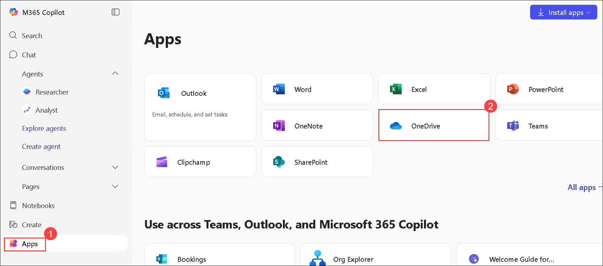

1. Select **Create or Upload (1)** and then select **File upload (2)**.

    

1. Navigate to **Downloads (1)**, then select **Promotion Plan for Chai Tea in Latin America.docx (2)** and then **Open (3)**.

    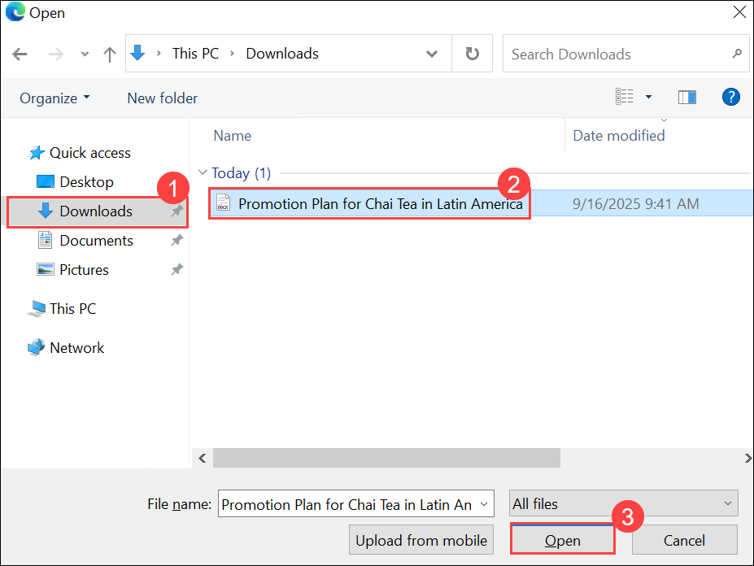

1. Make sure the file uploaded.


### Exercise 1 - Create a new presentation based on a Word document

1. Navigate back to [M365 Copilot](https://m365.cloud.microsoft/apps/?auth=2).

1. Select **Apps (1)** and then select **PowerPoint (2)** to start a new presentation.

    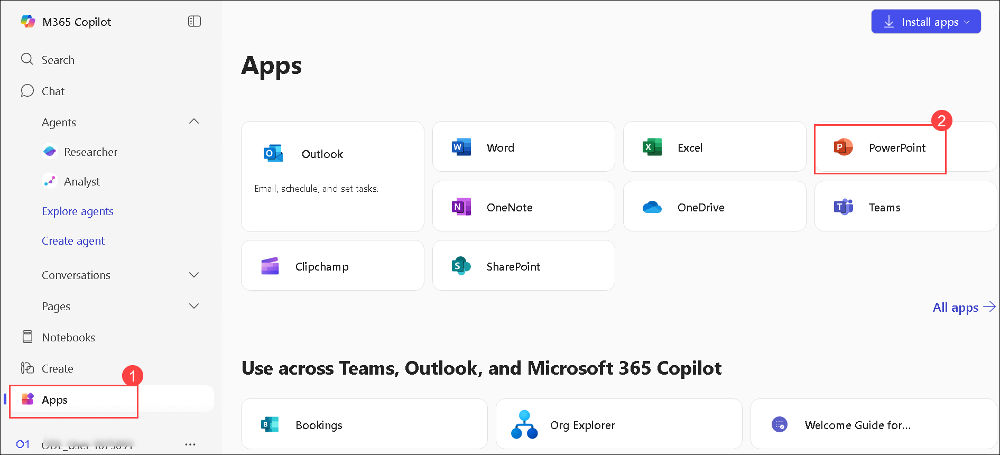

1. Select **Create a new presentation**.

    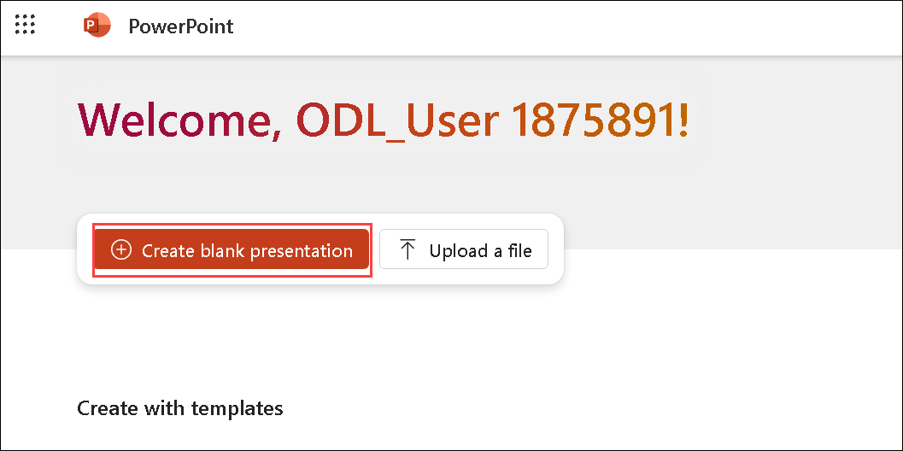

1. Select **Copilot (1)** and then select **Ask Copilot (2)**.  

    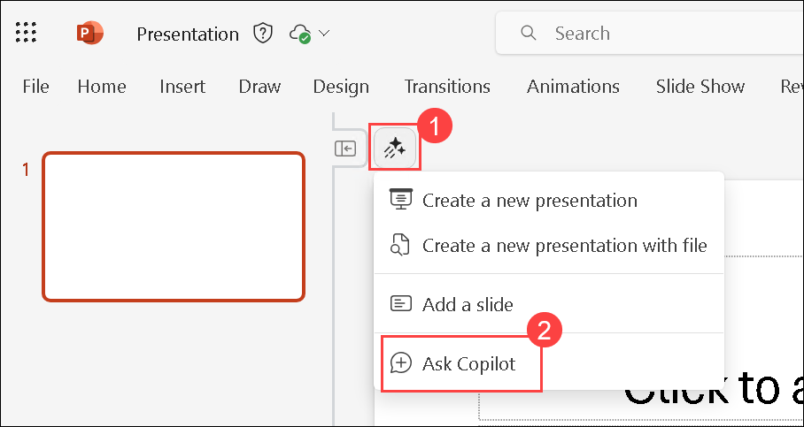

1. Select the **Copilot (1)** icon, then use Copilot to generate a draft presentation using the following prompt **(2)**:

   ```
   Create a presentation about Contoso's Chai Tea based on 
   ```

    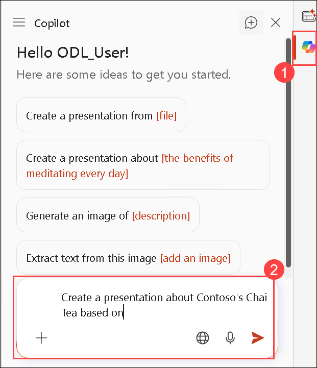

    - In the prompt dialog box, enter a forward slash (**/ (1)**) and select the file **(Promotion Plan for Chai Tea in Latin America.docx) (2)** and then **Send (3)**.
    
      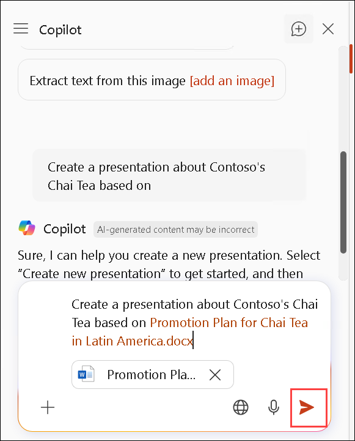    
    
       >**Note:** If the file doesn't populate in the list, select the plus button then **Attach**. Navigate to **My files** and select the document from your OneDrive folder.

1. Select **Create new presentation**.

    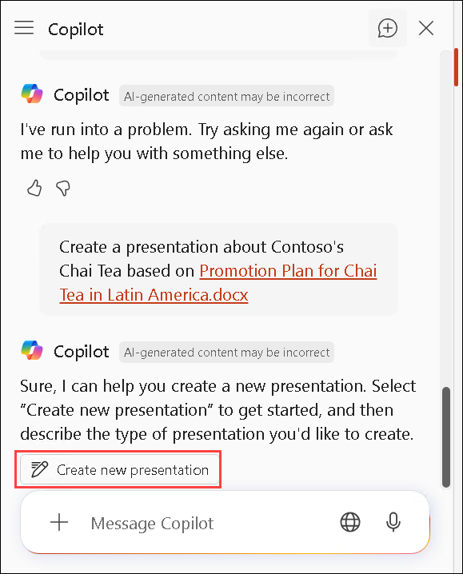

1. On the **Create a presentation with Copilot**, select **Referense file (1)** then upload the **Promotion Plan for Chai Tea in Latin America.docx (2)** and then select **Chage design (3)**.

    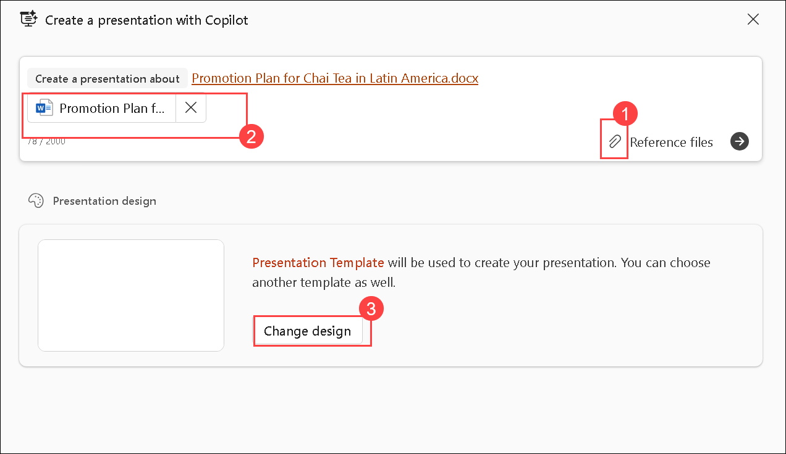

1. Navigate to **Micrososft 365 (1)**, then select a template **(2)** and then **Select Design (3)**.  

    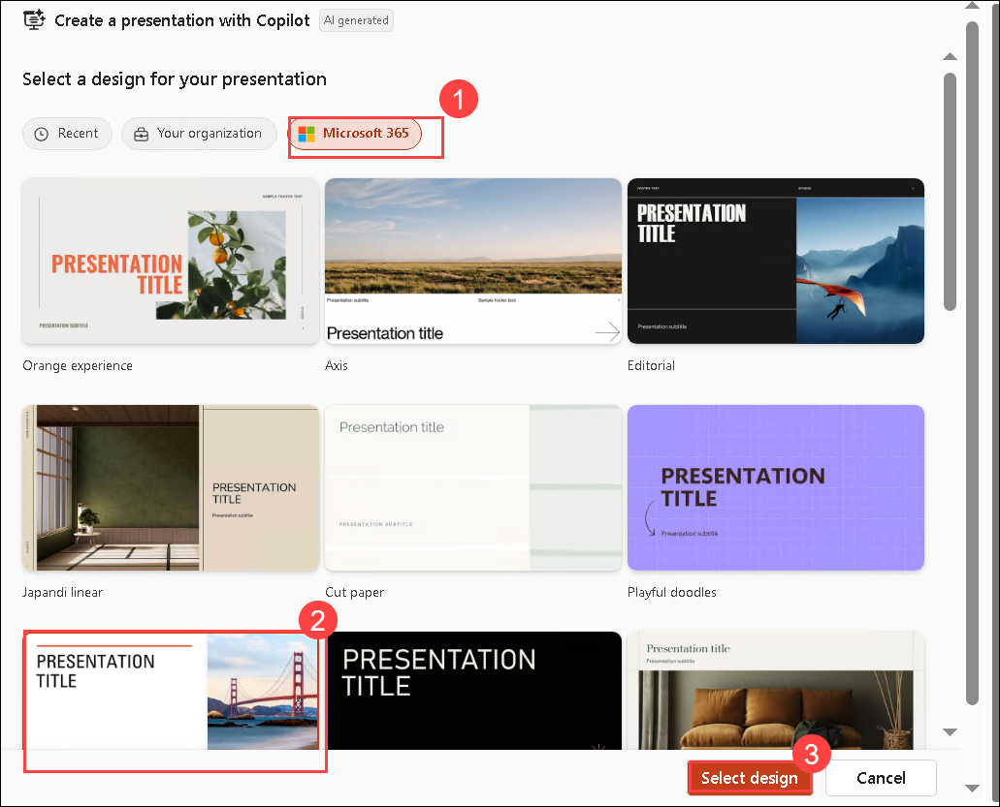

1. Select **Send**.

    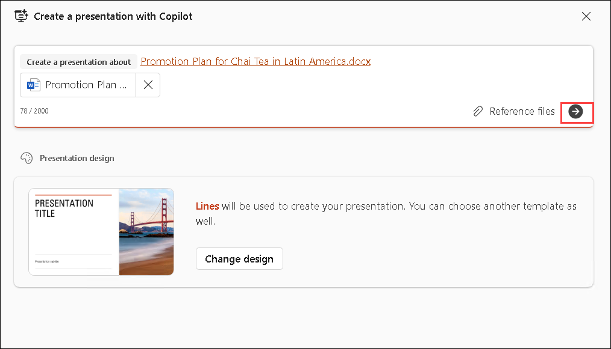

1. Copilot displays a presentation outline showing the potential slides and bulleted points to be included on each slide. Review the suggested topic and select **Generate slides** to continue.

    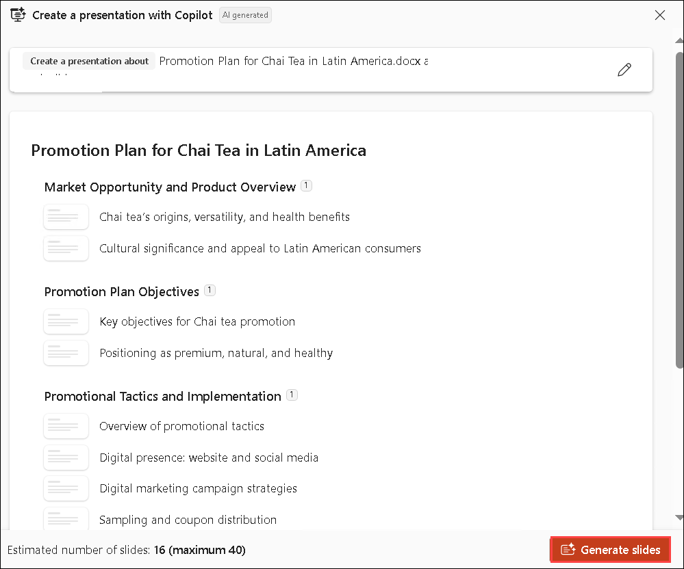

1. Copilot generates slides and content for each. The presentation may display results in either the **Slide Sorter** or **Normal** view.

1. Review the slides and select **Keep it** to continue.

    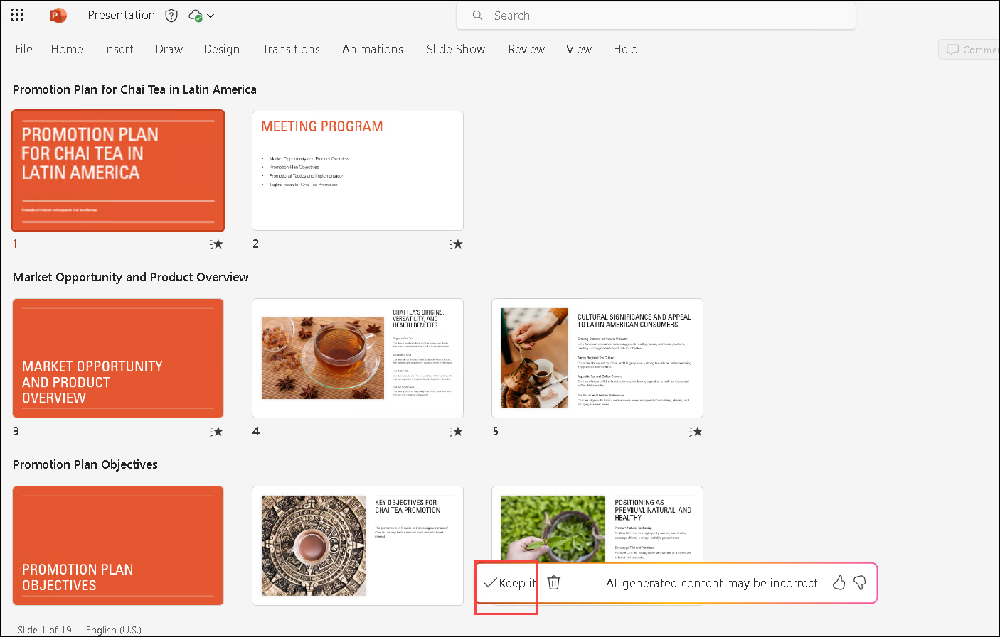

1. While this is a great start, you want to personalize the presentation a bit more for your delivery. Let's see how to improve the content.

### Exercise 2 - Ask Copilot to help you create an icebreaker slide

Because this presentation will be given both in-person and virtually, let's give our audience a few minutes to join without the possibility of missing important information. Copilot can help generate an idea and then a slide for a fun icebreaker to keep our audience occupied while others join.

1. Let's first change the view in PowerPoint, Select **View ()1-> Normal (2)**.

    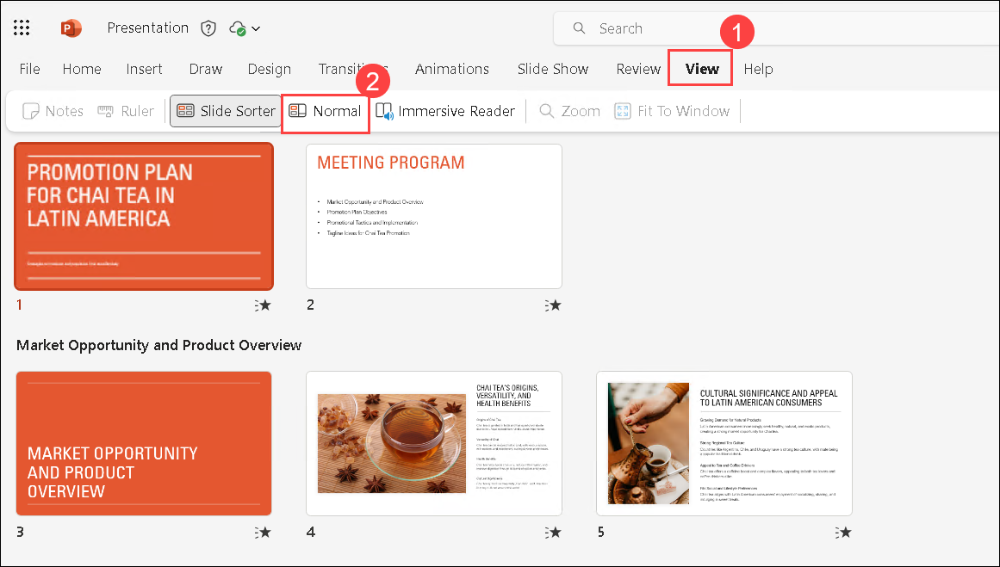

1. Return to the **Home (1)** ribbon view.Open the **Copilot (2)** pane 

    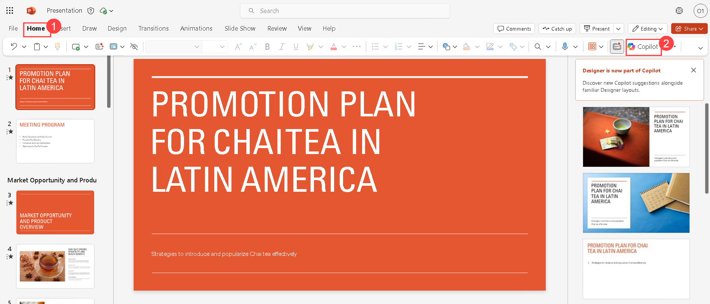

1. Enter the following prompt:

   ```
   Can you help me brainstorm an icebreaker question that would be good for a global audience? Provide three options for me to choose from. 
   ```

    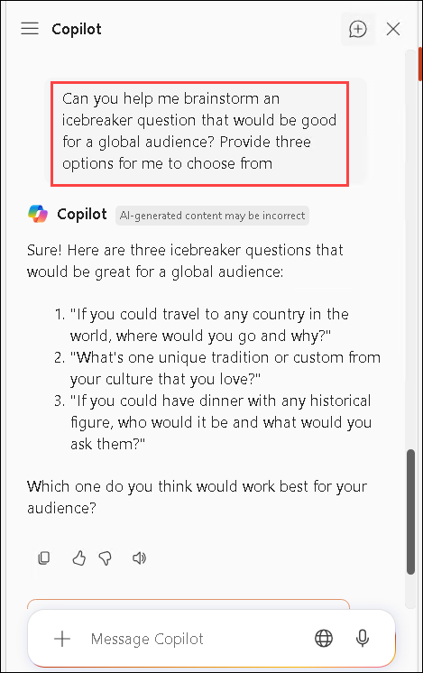   


1. The first question looks great for our audience, so let's ask Copilot to generate a slide with this question, a corresponding image **(1)**, and to insert this as the first slide in the presentation **(2)**.

1. Enter the following prompt:

   ```
   Use question 1 as the icebreaker, and generate a slide that includes a complementary image. Insert this slide as the first slide in the presentation. 
   ```

    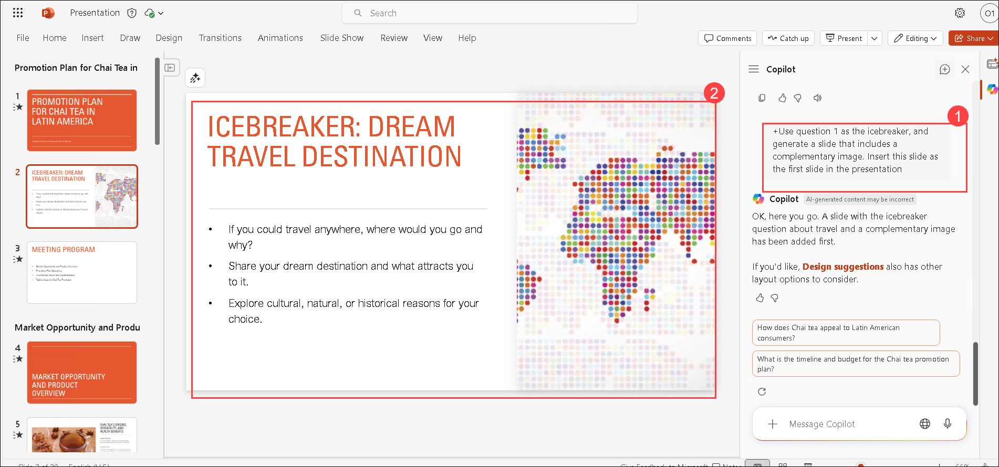   

    Now, you've got a great way to start a conversation among your meeting participants. Let's look at the presentation now, and see how we can make it even more powerful.

### Exercise 3 - Insert an image

While Copilot includes images as it creates slides, you may want to add or edit an image to be more specific to your presentation. You can ask Copilot to include an image from your approved corporate library, provided your administrator has set the appropriate configurations, or generate an image based on an idea you have.

1. Let's ask Copilot to insert a diagram on the title slide.

1. Navigate to the title slide that Copilot generated.

    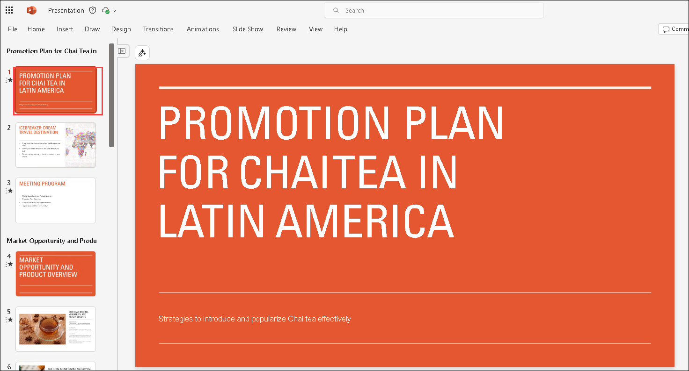

1. Enter the following prompt in the Copilot pane **(1)**:

   ```
   Replace the image on the Title slide with an image of a person sipping a warm cup of tea. 
   ```

    - Select one image **(2)** and then **insert (3)**

      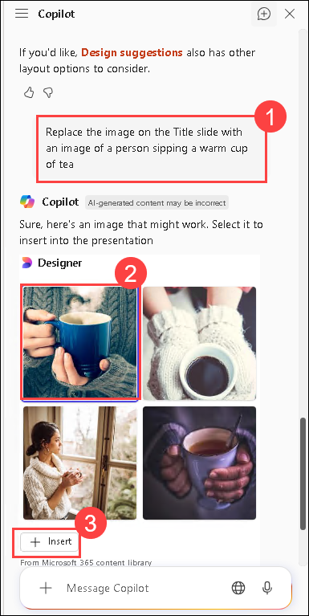    

1. Copilot opens the **Designer** feature and creates and displays an image that matches your request. Select one design **(1)**. Delete the original image and edit the new one to best fit the space in the slide **(2)**.

    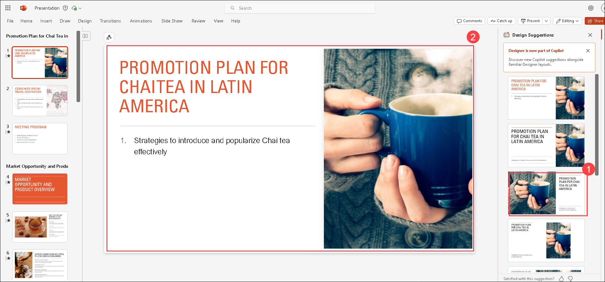

### Exercise 4 - Edit the text

As you're reviewing the presentation, you may decide the text Copilot generated isn't right for you. Use Copilot to help you refine the text on your slides. For instance, you can type *Edit the text on this slide to make it more concise* or *Make this text more engaging for the reader* Let's see how:

1. Navigate to the slide containing the text you may want to edit **(1)**

    - In the Copilot pane, enter the following prompt **(2)**:

      ```
      Edit this text to make it more conversational. 
      ```  
     - Select the text **(3)**
     - Select **+ Add selection (4)** and then **Send (5)**
       
       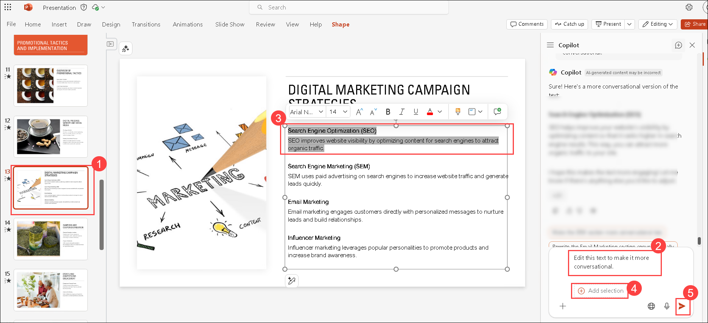       

1. Review the suggestions provided by Copilot.

    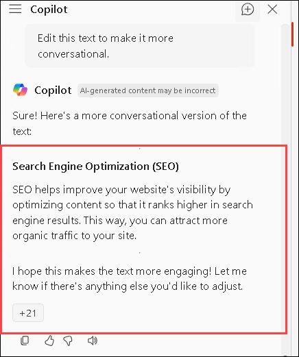

1. Copy and paste it onto the slide, and make any necessary adjustments.

    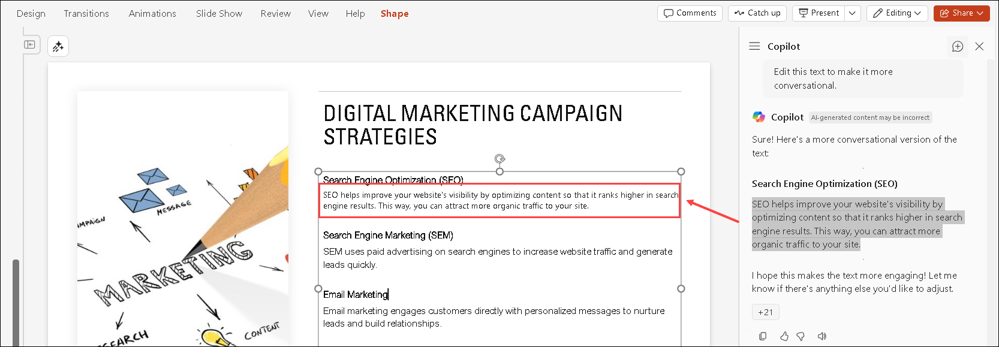

### Exercise 5 - Organize the presentation

As you're reviewing the presentation, you may find that the topics in your presentation need to be more clearly identified. You can use Copilot in PowerPoint to inject this clarity.

1. In the Copilot pane, enter the following prompt:

   ```
   Organize this presentation. 
   ```

1. Copilot responds, providing suggestions for each slide. You can select to update the content as you'd like or iterate your prompt to receive additional suggestions. 

1. Ensure that your presentation has a logical sequence and smooth transitions between slides.

### (Optional) Exercise - Send a draft for review

Once you're satisfied with your presentation, use Copilot in Outlook to draft an email to your manager for review.

1. Launch Microsoft Outlook from your browser [outlook.office.com](https://outlook.office.com).

1. Select **New mail**.

    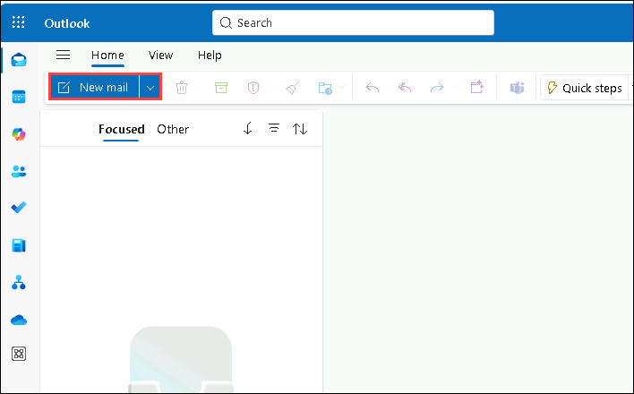

1. Select **Draft with Copilot**.

    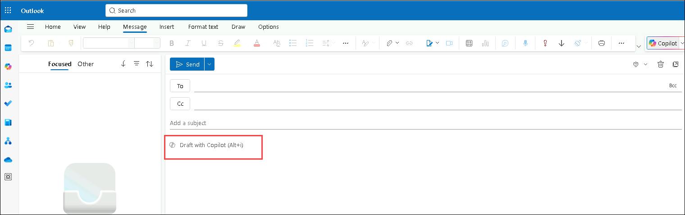

1. Enter the following prompt **(1)** and then **Send (2)**:

   ```
   Draft an email asking for a review of the presentation that I attached to this email. Write the email in a casual tone. 
   ```

    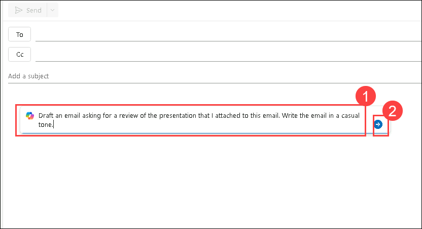   

1. Review the email draft **(1)**, make any necessary edits, and mention mail ID of intended recipient **(2)** and then **Send (3)**.

    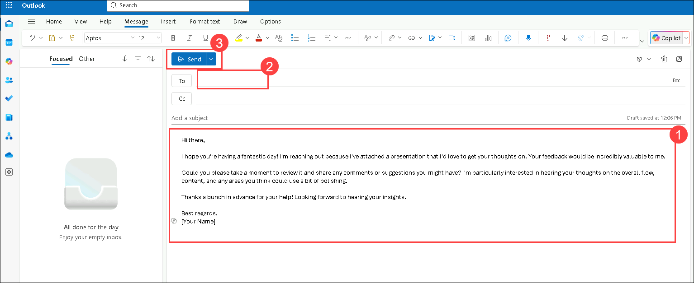


### Summary

In this lab, you explored how Microsoft 365 Copilot in PowerPoint can help build a professional presentation from start to finish. You created a new presentation from a Word document, added an icebreaker slide, inserted and edited images, refined text, and organized content to ensure clear flow. Finally, you applied corporate branding standards and shared the draft for review, experiencing how Copilot streamlines collaboration and enhances presentation design.

### You have successfully completed the Hands-on Lab!
