# Lab 02: Draft, improve, and share your document with Copilot in Word

### Estimated Duration : 45 Minutes

## Lab Scenario

Imagine you're a project manager tasked with creating a comprehensive project report for your company's new Mystic Spice Premium Chai Tea. In this Lab, you use Microsoft Word to draft the report, (optionally) import notes from OneNote, and share the draft with your team via Microsoft Teams or Microsoft Outlook for feedback and collaboration.

## Lab Objectives

In this lab, you will complete the following tasks:

- Task 1: Draft your content
- Task 2: Convert text to a table
- Task 3: Summarize your document

## Lab prerequisites

Throughout this Lab, we'll craft prompts for Microsoft 365 Copilot that reference this file. You should have already uploaded it to OneDrive during the lab setup process, but if you need to download it again, you can do so here:

1. In the Lab VM, open a web browser, right click on the following link [Market Analysis Report for Mystic Spice Premium Chai Tea.docx](https://go.microsoft.com/fwlink/?linkid=2268826) then **Copy link** and then paste it on the browser tab to download the word file.

1. Select **Download file**.

    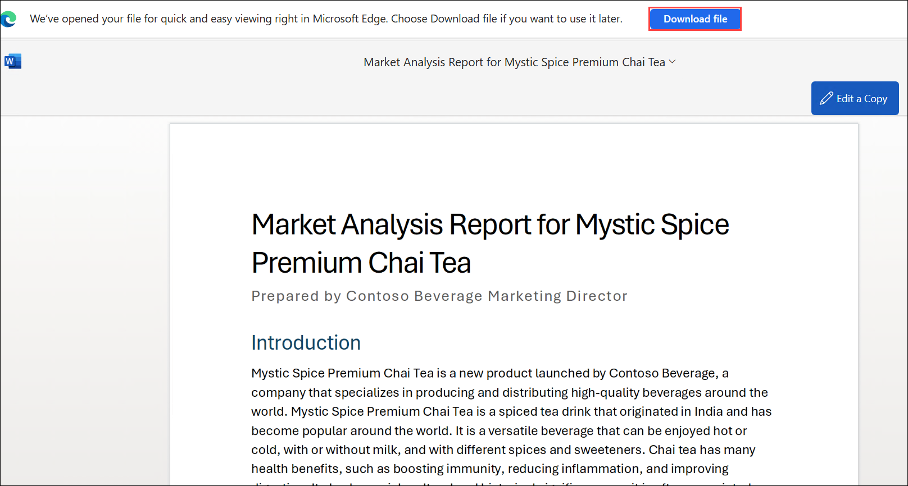

1. Right click on the following link, [M365 Copilot](https://m365.cloud.microsoft/apps/?auth=2) then **Copy link** and then paste it on the browser tab to navigate to the **M365 Copilot**.

1. Provide the credentials below to login:

   - **Email/Username:** <inject key="AzureAdUserEmail"></inject>

   - **Password:** <inject key="AzureAdUserPassword"></inject>

1. Select **Apps (1)** and then select **Onedrive (2)**.   

    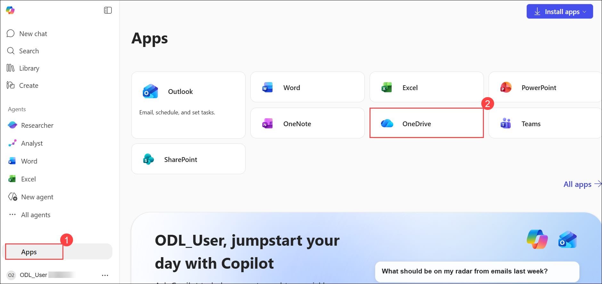

1. Navigate to **My files**.

    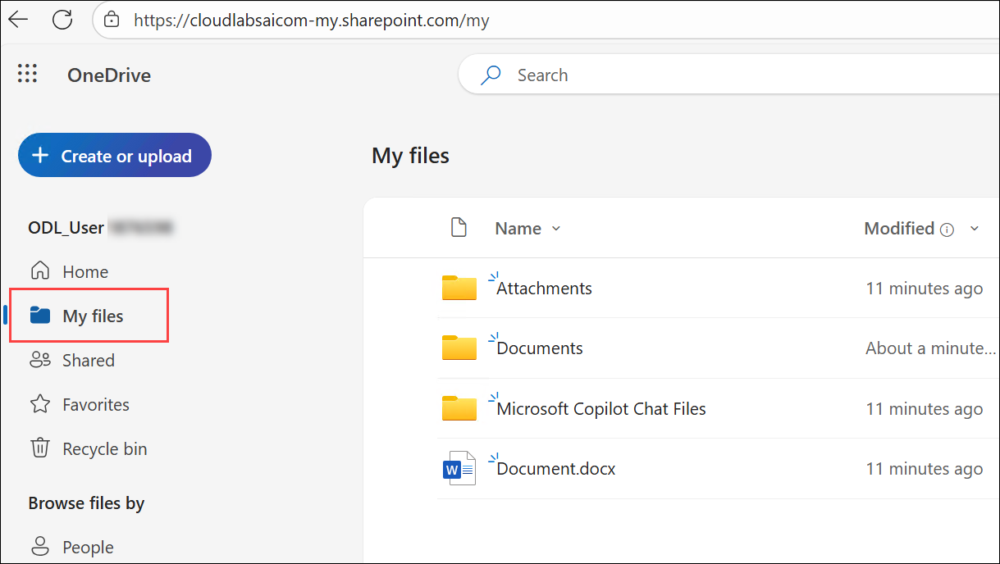

1. Select **+ Create or Upload (1)** and then select **Files upload (2)**.

    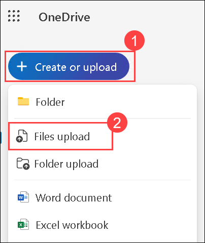

1. Navigate to **Downloads (1)**, then select **Market Analysis Report for Mystic Spice Premium Chai Tea.docx (2)** and then **Open (3)**.

    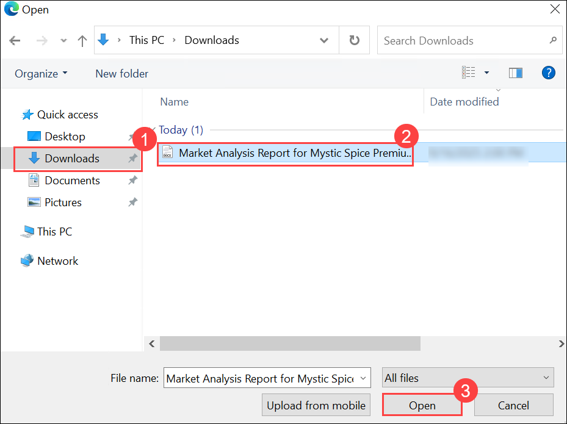

1. Make sure the file uploaded.


## Task 1: Draft your content

In this task, you will use Copilot in Word to create a project report from an existing Market Analysis document, then refine and rewrite sections to make the content professional and engaging.

1. Navigate back to [M365 Copilot](https://m365.cloud.microsoft/apps/?auth=2).

1. Select **Apps (1)** and then select **Word (2)** to start a new presentation.

    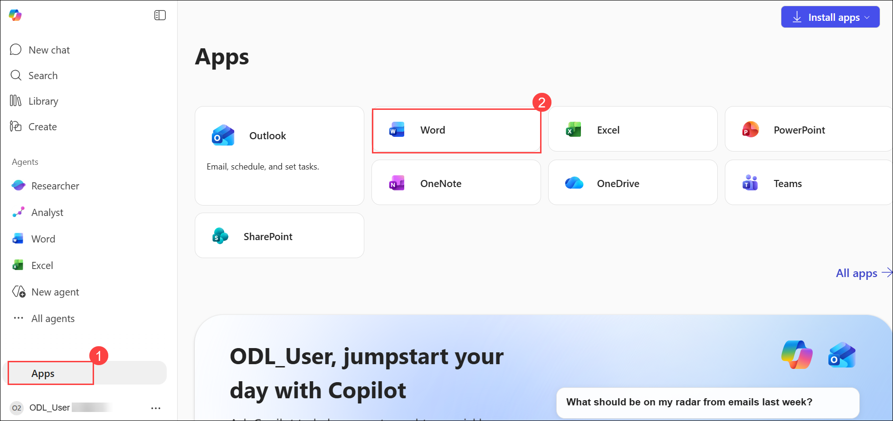

1. Select **+ Create blank document**.

    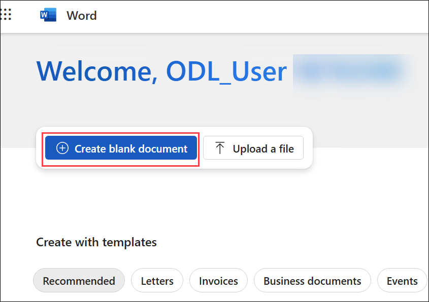

1. Select the on-canvas **Copilot** experience at the top of the blank document.

    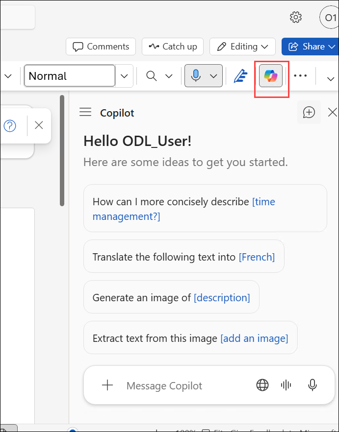

1. Enter the following prompt **(1)**:

   ```
   Create a project report that includes an executive summary, introduction, product description, project objectives, and discussion. Use the linked document as a content resource. 
   ```

1. Add the document reference to your prompt by manually entering a forward slash followed by the document name: **/Promotion Plan for Chai Tea in Latin America.docx** and click on **Send (2)**. 

    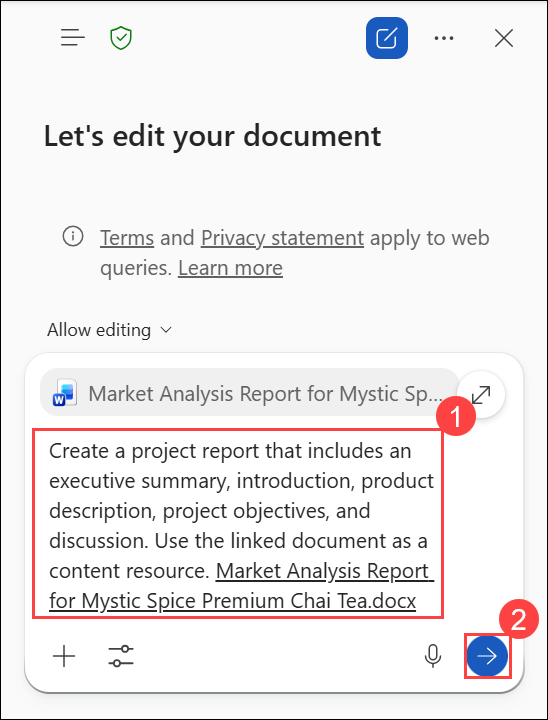

    >**Note:** Alternately, you can select Add content and the file from the dropdown list once it is available in OneDrive.

    - Select **+ (1)** to add the file 

    - Select **Attach cloud files (2)**.

        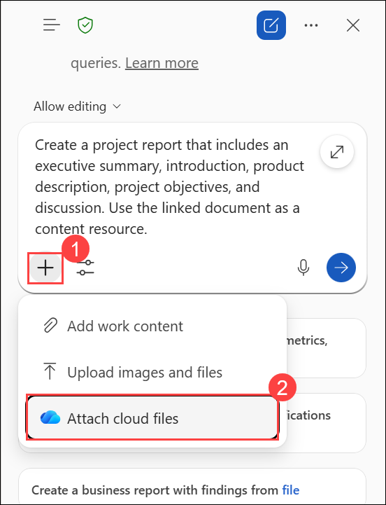 

    - Navigate to **My files (1)**, select **Market Analysis Report for Mystic Spice Premium Chai Tea.docx (2)** and then **Select (3)**.     

        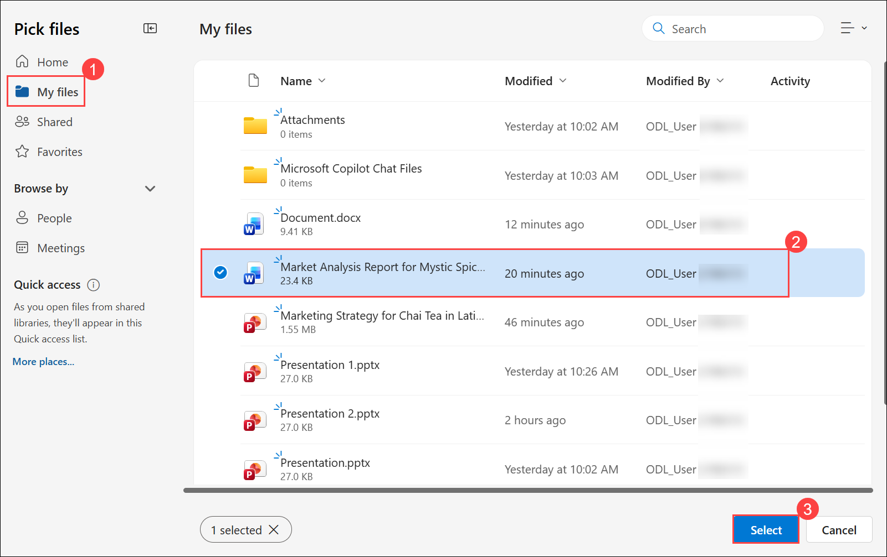 

1. Review the drafted content and select **Keep it**.

    > **Note:** If Copilot takes too long or times out while generating the executive summary or inserting content into the document, try running the prompt again or ask Copilot to generate the content in chat first and then copy and paste it into the document manually. This helps avoid delays caused by temporary responsiveness issues in the Word editor.

1. As you're reviewing the content of your document, you may find that some text needs to be edited or rewritten. The `Product Description section seems to be fairly short, and technical`. Let's edit the text so it's more engaging for our readers.

1. Highlight the paragraph **(1)**, select the **Edit with Copilot (2)**.

    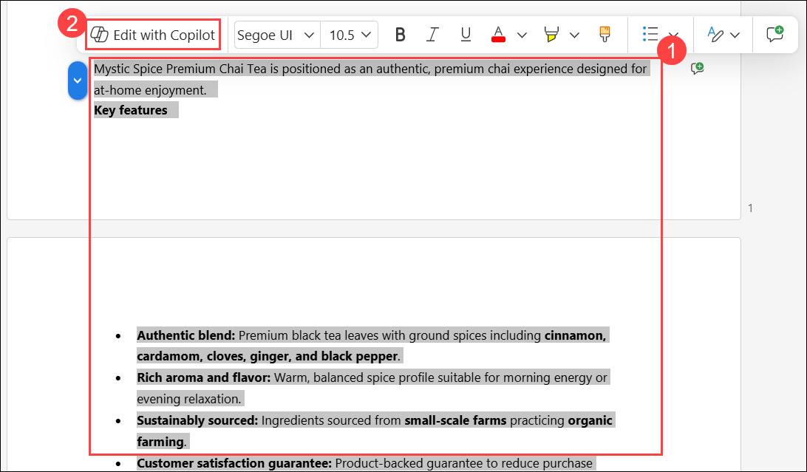

1. Select **Auto rewrite** from the menu. 

    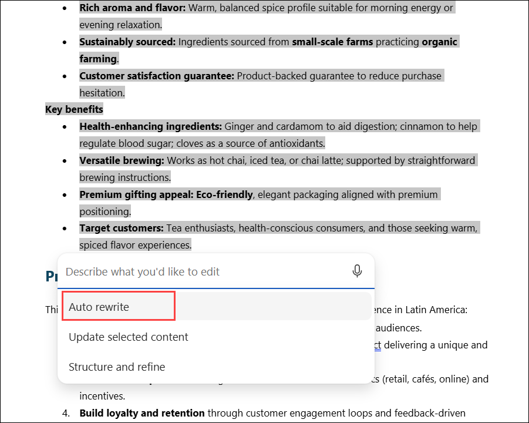

1. Copilot generates several options. Review each:

    - **Replace (1)** the current text with the one you prefer.
    - **Insert below (2)** the text to keep both.
    - **Regenerate (3)** the suggestions if you don't like any of the suggestions, you can select to regenerate them, and Copilot provides you three more options from which to choose.
    - Enter text describing the update you're looking for in the **What do you want Copilot to change? (4)** field.

      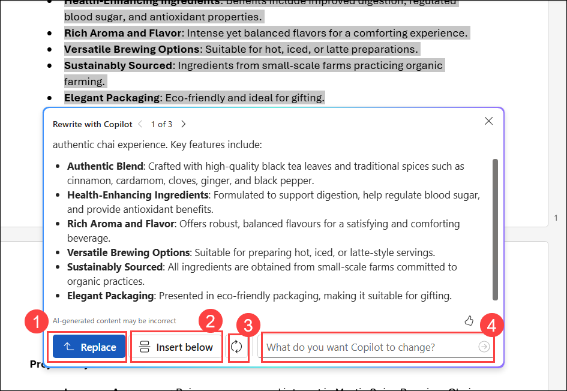    

1. Let's enter a specific prompt to get the results we want. In the **What do you want Copilot to Change** field.

    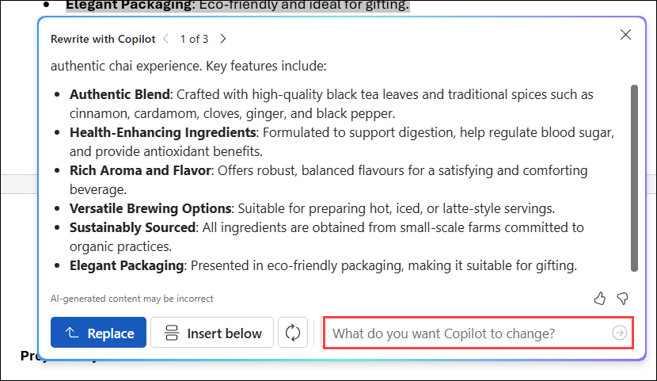

1. Enter the following prompt **(1)** and then **Generate (2)**:

   ```
   Rewrite this paragraph to add more detail about the product. The tone of this paragraph should be professional and engaging. 
   ```

    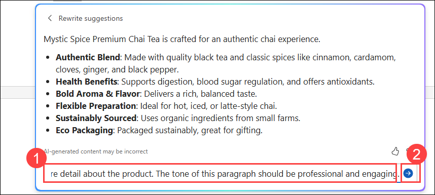   

1. Review the rewritten options, choose the one you most prefer, and select **Replace**.

    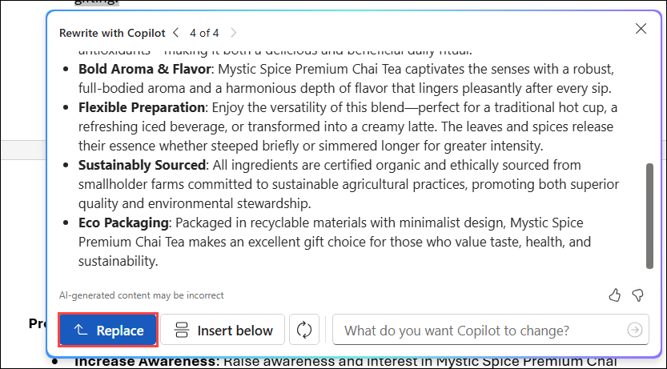

> **Congratulations** on completing the task! Now, it's time to validate it. Here are the steps:

- Hit the Validate button for the corresponding task. You will receive a success message. 
- If not, carefully read the error message and retry the step, following the instructions in the lab guide.
- If you need any assistance, please contact us at cloudlabs-support@spektrasystems.com. We are available 24/7 to help you out.

<validation step="acdba74e-97be-4104-bd81-8bb0a268c45d" />

## Task 2: Convert text to a table

In this task, you will use Copilot in Word to transform text or lists into a table, enhancing readability and adding additional columns as needed for clarity.

Let's see this transformation in action.

1. In the Word document, place your cursor at the end of a paragraph, press **Enter** to start a new line, and then select the on-canvas **Copilot**.

    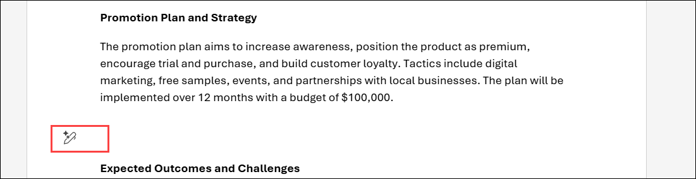

1. Ask Copilot to `Add a list of project milestones and their deadlines` **(1)** and then select **Generate (2)**.

    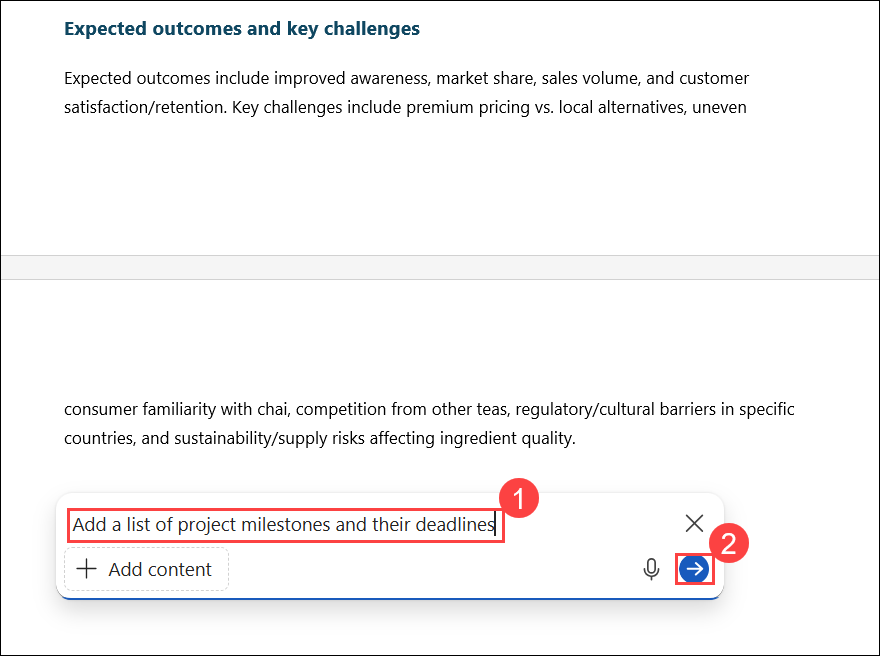

1. Select **Keep it** to add the section to your Project Plan.

    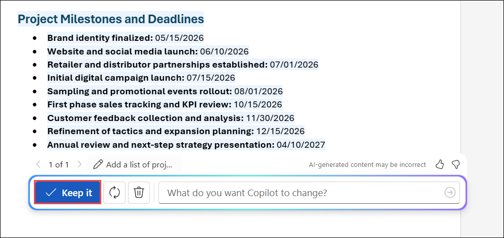

1. Highlight the list **(1)**. Select the **Edit with Copilot (2)**.

    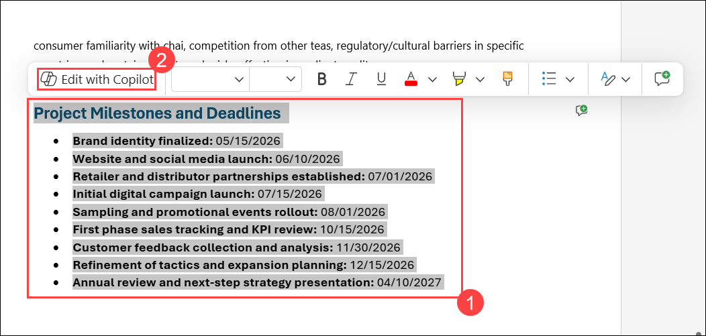

1. Enter the prompt `Visualize this as a table` **(1)** and then click on **Generate (2)**.

    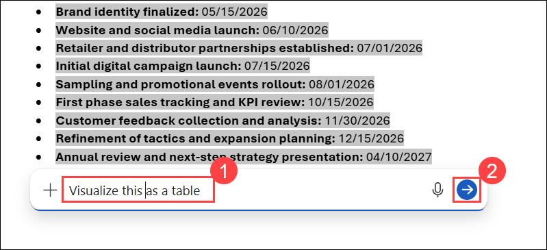

1. The result looks great, overall, but let's make sure there's a column for when the task is successfully completed.

    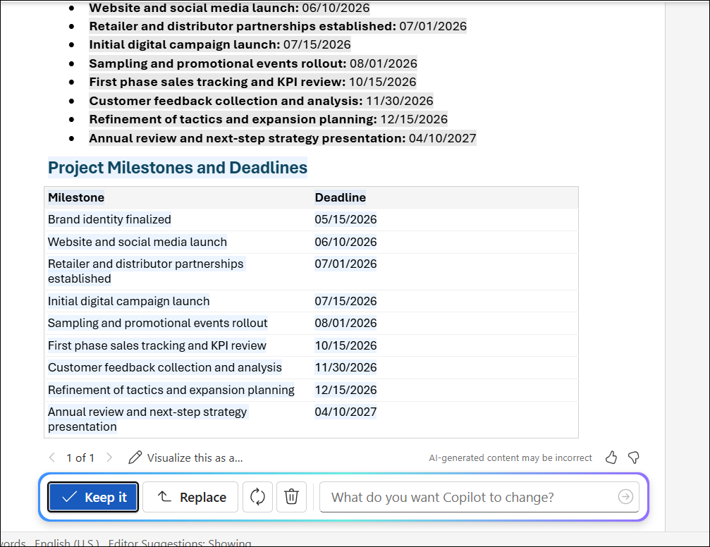

1. Enter the following prompt **(1)** and then **Generate (2)**:

    ```
    Add a third column, Task Completed, to the table. 
    ```

    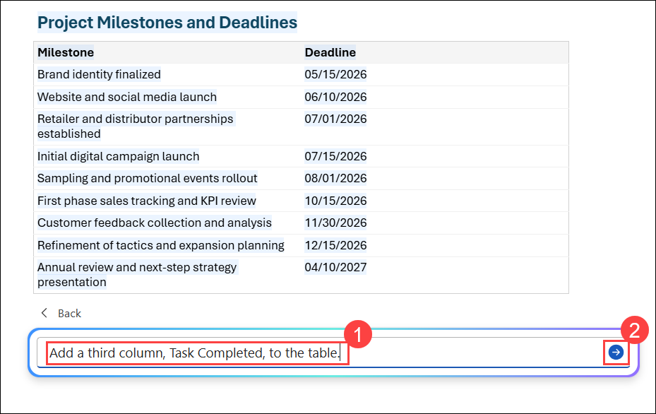  

1. Select **Keep it** to insert the table into your document. Make sure **Task Completed** column is added.

    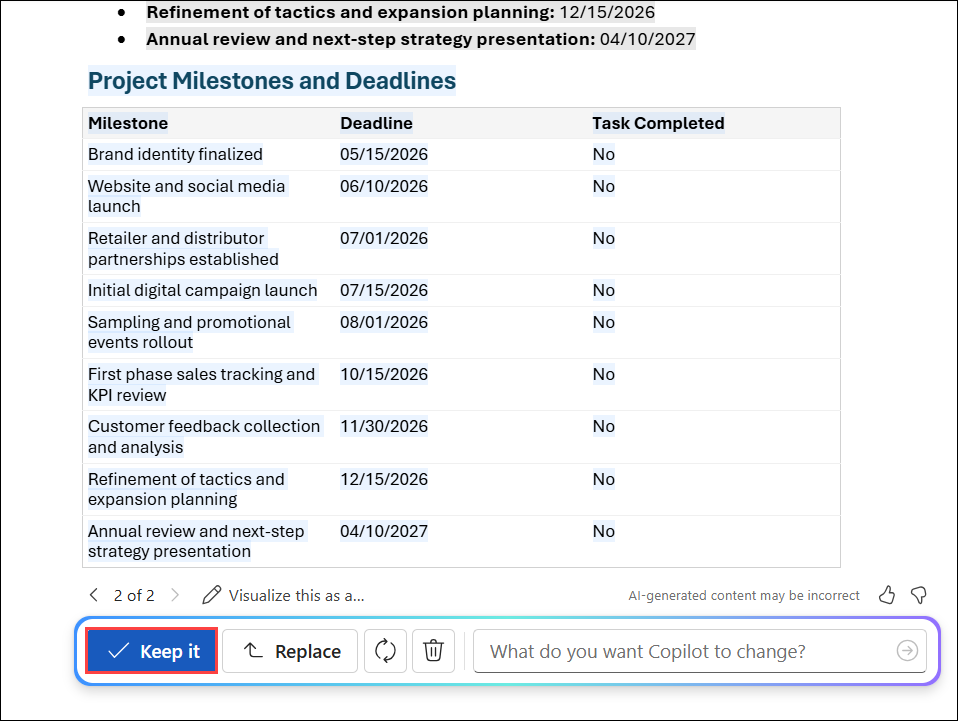

1. Review the table format and make any necessary adjustments. You can then delete the bulleted list from the Project Milestones and Deadlines section.

> **Congratulations** on completing the task! Now, it's time to validate it. Here are the steps:

- Hit the Validate button for the corresponding task. You will receive a success message. 
- If not, carefully read the error message and retry the step, following the instructions in the lab guide.
- If you need any assistance, please contact us at cloudlabs-support@spektrasystems.com. We are available 24/7 to help you out.

<validation step="794dc3b2-5696-48a6-bfd7-4df4967006dd" />

## Task 3: Summarize your document

In this task, you will use Copilot in Word to generate a summary of your report, highlighting key points to ensure clarity and prepare the content for sharing or further use.

1. Open the **Copilot** pane.

    

1. Enter the following prompt:

    ```
    Summarize this document. Highlight the top three points made. 
    ```

    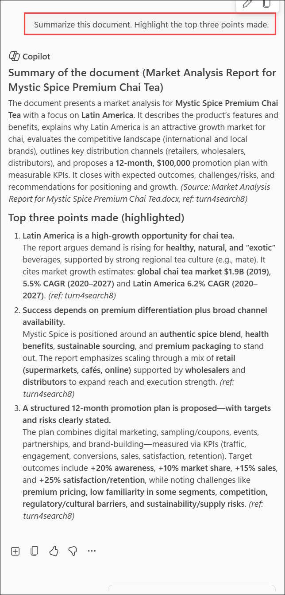

1. Review the generated summary, and select **Add to doc** (the plus sign) if you want to include the entire summary in your document. You can also highlight any portion of the text, then copy and paste it into your document.

    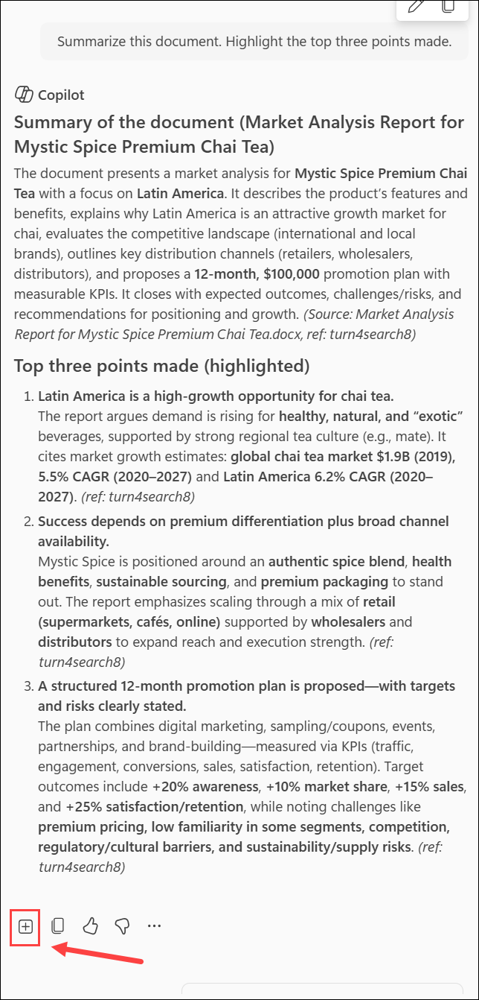

   >**Note**: The text Copilot generates is inserted at your cursor's location in the document. Make sure you have navigated to the end of the document before you select to insert the content.

    You can then manually make adjustments to the text, or highlight the summary paragraph and use Copilot to **Auto Rewrite**  as needed. You can also use this summary as the starting point to a Teams or Outlook message when you share your project report with your stakeholders.

1. Save your document for future reference. You're ready to share for review, or you can use this document as the starting point for a PowerPoint presentation.

## Summary

In this lab, you explored how Microsoft 365 Copilot in Word can help draft, improve, and share a professional document. You created a project report using Copilot prompts, rewrote and refined content, and converted text into a table for better readability. Finally, you summarized the document and prepared it for sharing, experiencing how Copilot streamlines writing and collaboration.

### You have successfully completed the lab. Click Next >> to proceed.

