# Lab 2 - Draft, improve, and share your document with Copilot in Word

### Lab Overview

Imagine you're a project manager tasked with creating a comprehensive project report for your company's new Mystic Spice Premium Chai Tea. In this Lab, you use Microsoft Word to draft the report, (optionally) import notes from OneNote, and share the draft with your team via Microsoft Teams or Microsoft Outlook for feedback and collaboration.

>**NOTE:** While this Lab illustrates how information can flow from one Microsoft 365 app to another, you aren't required to do so. Each of these steps can be completed using Copilot in Word directly. Alternate steps are provided as necessary.

### Lab prerequisites

Throughout this Lab, we'll craft prompts for Microsoft 365 Copilot that reference this file. You should have already uploaded it to OneDrive during the lab setup process, but if you need to download it again, you can do so here:

1. In the Lab VM, open a web browser, right click on the following link [Market Analysis Report for Mystic Spice Premium Chai Tea.docx](https://go.microsoft.com/fwlink/?linkid=2268826) then **Copy link** and then paste it on the browser tab to download the word file.

1. Select **Download file**.

    

1. Right click on the following link, [M365 Copilot](https://m365.cloud.microsoft/apps/?auth=2) then **Copy link** and then paste it on the browser tab to navigate to the **M365 Copilot**.

1. Select **Apps (1)** and then select **Onedrive (2)**.   

    

1. Navigate to **My files**.

    

1. Select **Create or Upload (1)** and then select **File upload (2)**.

    

1. Navigate to **Downloads (1)**, then select **Market Analysis Report for Mystic Spice Premium Chai Tea.docx (2)** and then **Open (3)**.

    

1. Make sure the file uploaded.


### Task 1 - Draft your content

Let's create a project report using the Market Analysis you've already gathered. Then, we can edit this file to get the content we need for our report.

1. Navigate back to [M365 Copilot](https://m365.cloud.microsoft/apps/?auth=2).

1. Select **Apps (1)** and then select **Word (2)** to start a new presentation.

    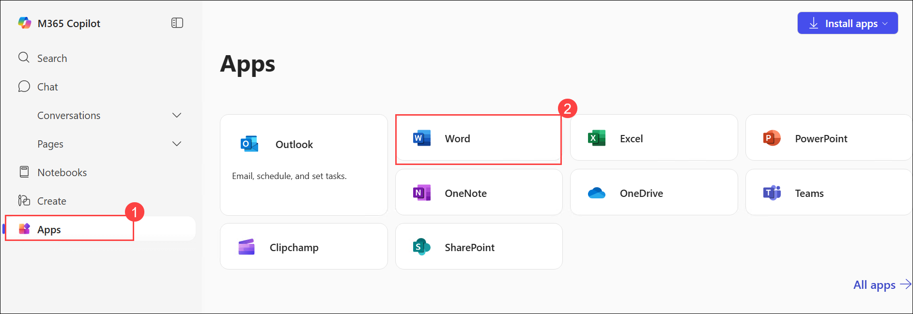

1. Select **Create blank document**.

    

1. Select the on-canvas **Copilot** experience at the top of the blank document.

    

1. Enter the following prompt **(2)**:

   ```
   Create a project report that includes an executive summary, introduction, product description, project objectives, and discussion. Use the linked document as a content resource. 
   ```

   - Select **+ (2)** to add the file

     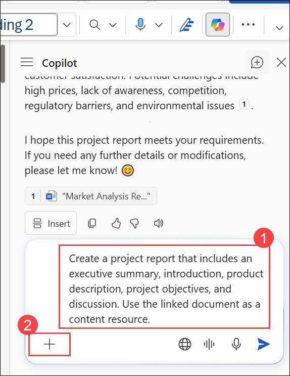 

1. Select **Attach**.

    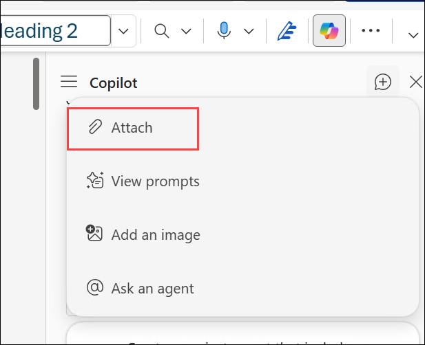

1. Click **Upload (1)** icon and then select **Attach cloud files (2)**.

    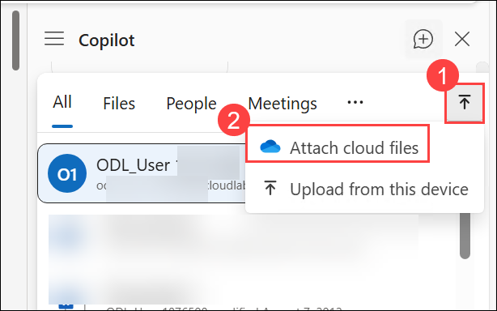

1. Navigate to **My files (1)**, select **Market Analysis Report for Mystic Spice Premium Chai Tea.docx (2)** and then **Select (3)**.     

    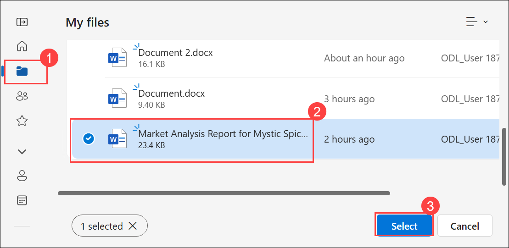

1. Select **Send**.

    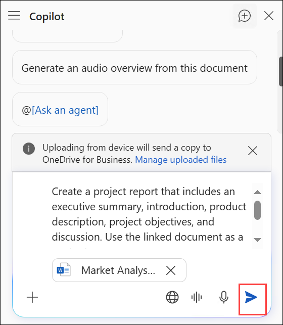

1. Review the drafted content.

    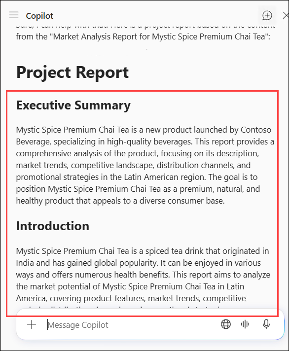

1. Select **Insert (1)** to paste the content to the blank document **(2)**.

    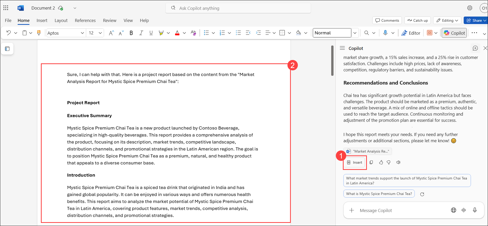

1. As you're reviewing the content of your document, you may find that some text needs to be edited or rewritten. The `Product Description section seems to be fairly short, and technical`. Let's edit the text so it's more engaging for our readers.

1. Highlight the paragraph **(1)**, select the **Copilot (2)** icon that appears to the left of the text.

    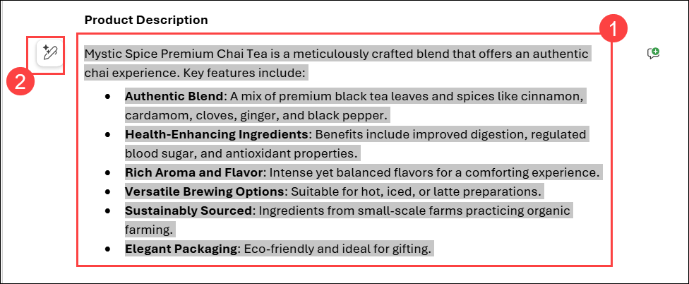

1. Select **Auto Rewrite** from the menu. 

    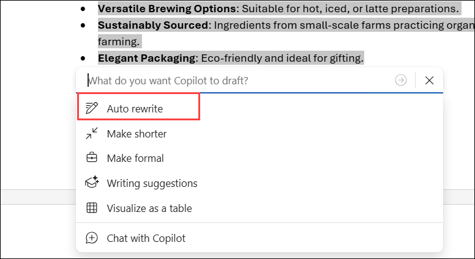

1. Copilot generates several options. Review each:

    - **Replace (1)** the current text with the one you prefer.
    - **Insert below (2)** the text to keep both.
    - **Regenerate (3)** the suggestions if you don't like any of the suggestions, you can select to regenerate them, and Copilot provides you three more options from which to choose.
    - Enter text describing the update you're looking for in the **What do you want Copilot to change? (4)** field.

          

1. Let's enter a specific prompt to get the results we want. In the **What do you want Copilot to Change** field.

    

1. Enter the following prompt **(1)** and then **Send (2)**:

   ```
   Rewrite this paragraph to add more detail about the product. The tone of this paragraph should be professional and engaging. 
   ```

       

1. Review the rewritten options, choose the one you most prefer, and select **Replace**.

    

### Task 2 - Convert text to a table

While the content in your document may be accurate, consider its readability. Would a section work better if it was presented as a table? Copilot can easily convert text into a table using a prompt.

Let's see this transformation in action.

1. In the Word document, place your cursor at the end of a paragraph, press **Enter** to start a new line, and then select the on-canvas **Copilot**.

    

1. Ask Copilot to `Add a list of project milestones and their deadlines` **(1)** and then **Send (2)**.

    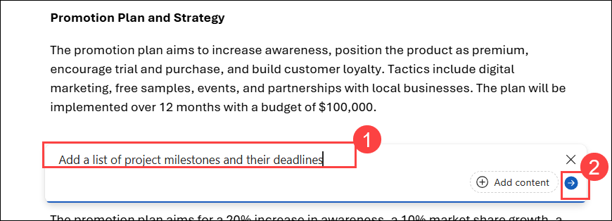

1. Select **Keep it** to add the section to your Project Plan.

    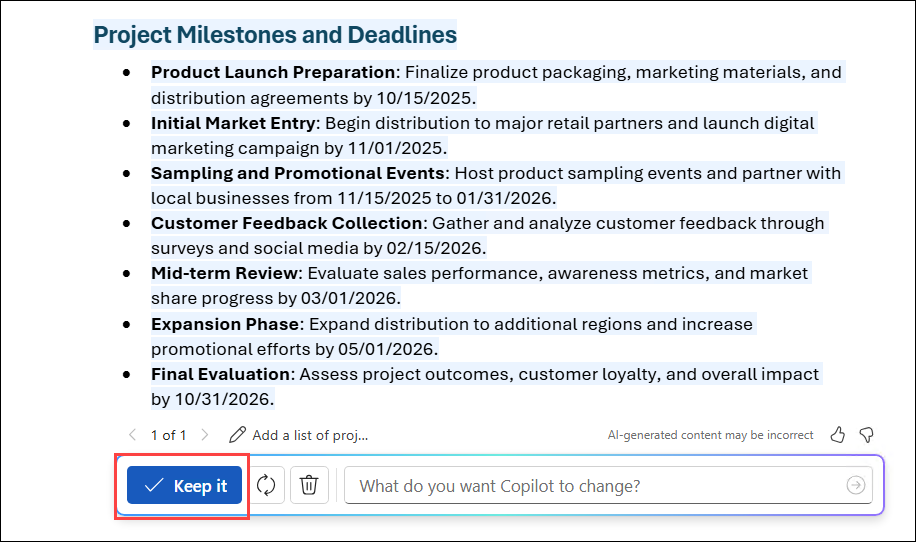

1. Highlight the list **(1)**. Select the on-canvas **Copilot (2)** icon to the left of the text.

    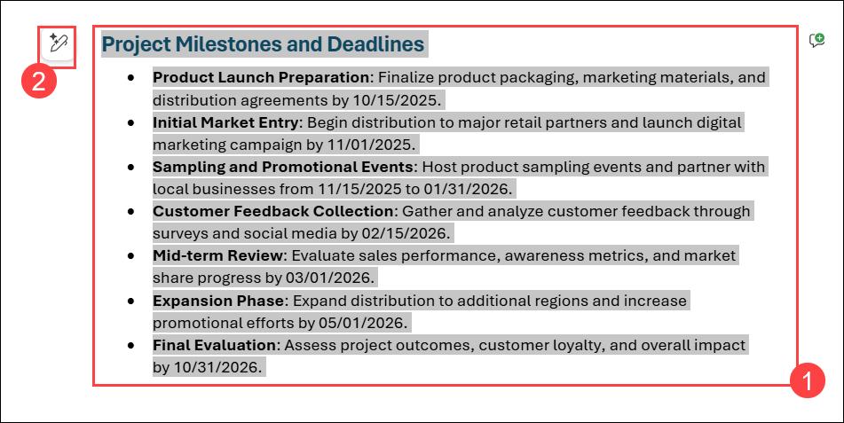

1. Select **Visualize as a table** from the menu. 

    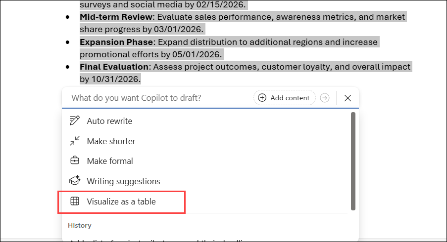

1. The result looks great, overall, but let's make sure there's a column for when the task is successfully completed.

    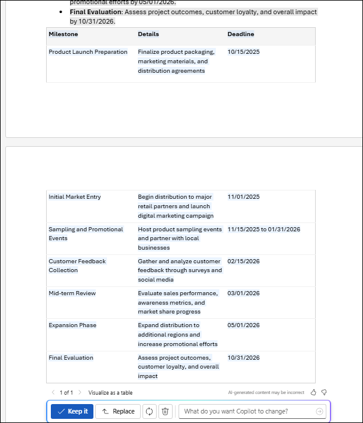

1. Enter the following prompt **(1)** and then **Send (2)**:

   ```
   Add a third column, Task Completed, to the table. 
   ```

    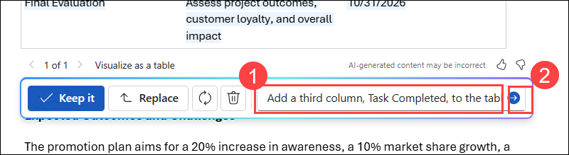   

1. Select **Keep it (1)** to insert the table into your document. Make sure **Task Completed (2)** is added.

    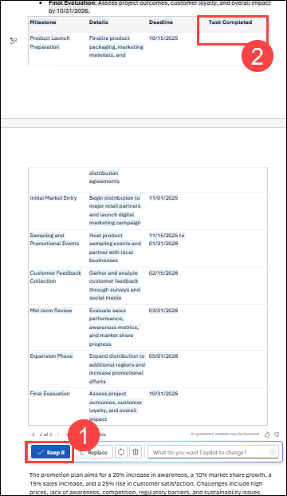

1. Review the table format and make any necessary adjustments.

    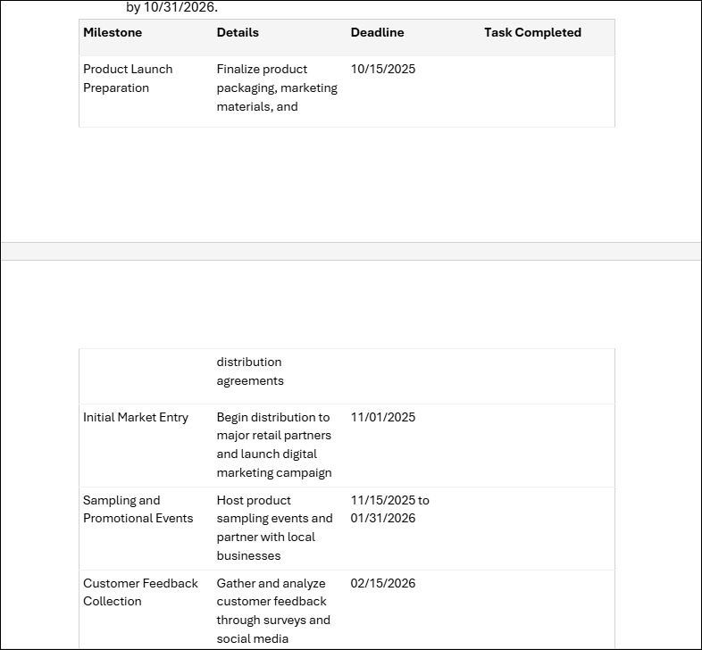

### Task 3 - Summarize your document

As you complete your document, you want to ensure that your key points are presented clearly. A good way to do this is to see a summary of the document. Likewise, should you receive a large Word document that you don't have time to read in its entirety, the summary feature is key. Let's create a summary at the end of our document.

1. Open the **Copilot** pane.

    

1. Enter the following prompt:

   ```
   Summarize this document. Highlight the top three points made. 
   ```

    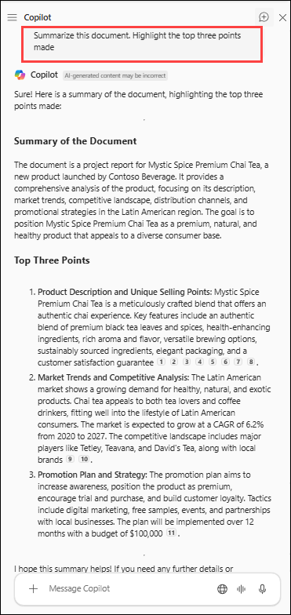   

1. Review the generated summary, and select **Insert** if you want to include the entire summary in your document. You can also highlight any portion of the text, then copy and paste it into your document.

   >**Note**: The text Copilot generates is inserted at your cursor's location in the document. Make sure you have navigated to the end of the document before you select to insert the content.

    You can then manually make adjustments to the text, or highlight the summary paragraph and use Copilot to **Auto Rewrite**  as needed. You can also use this summary as the starting point to a Teams or Outlook message when you share your project report with your stakeholders.

1. Save your document for future reference. You're ready to share for review, or you can use this document as the starting point for a PowerPoint presentation.

### Summary

In this lab, you explored how Microsoft 365 Copilot in Word can help draft, improve, and share a professional document. You created a project report using Copilot prompts, rewrote and refined content, and converted text into a table for better readability. Finally, you summarized the document and prepared it for sharing, experiencing how Copilot streamlines writing and collaboration.

### You have successfully completed the Hands-on Lab!
