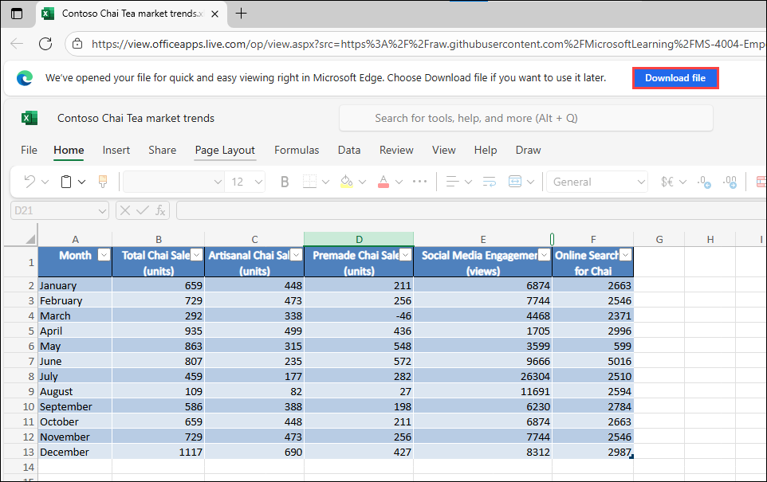
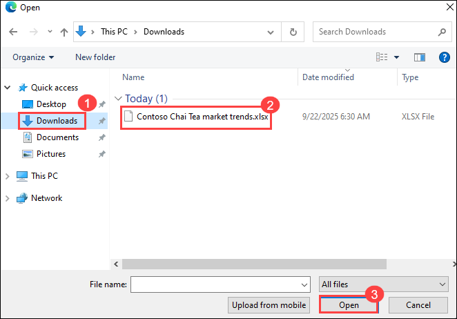
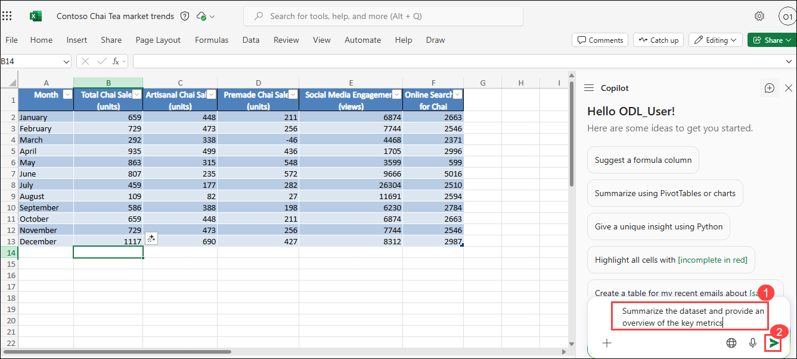
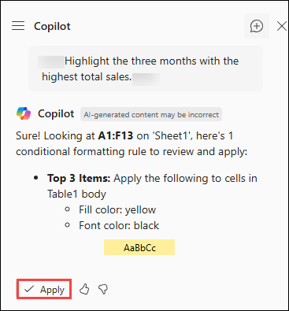
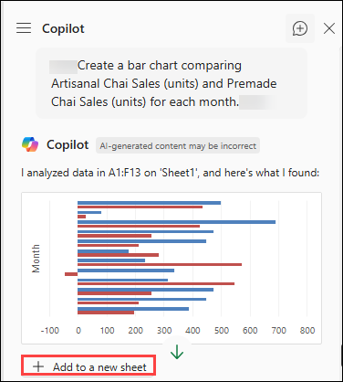
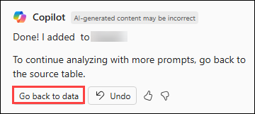
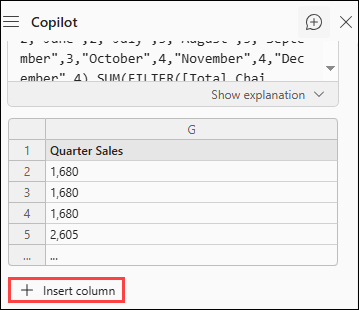
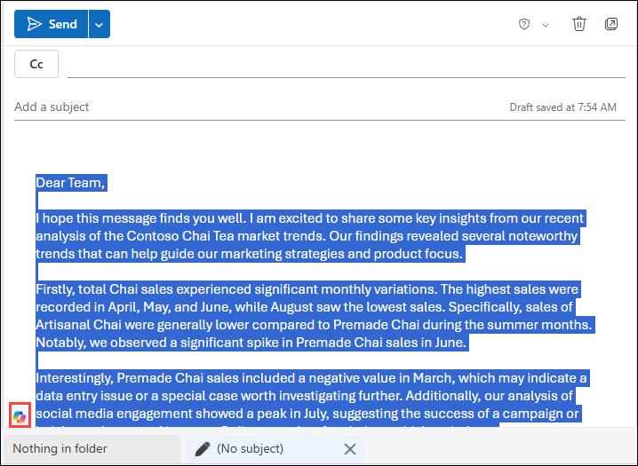
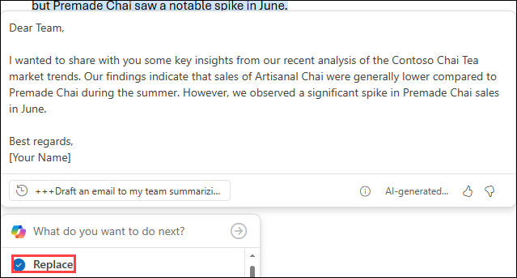

# Lab 04: Boost your productivity with data-driven decisions with Copilot in Excel

### Estimated Duration : 45 Minutes

## Lab Overview

In this hands-on lab, you’ll work with Copilot in Excel to analyze sales data for Contoso’s Chai products. You’ll start by exploring the dataset, identifying key metrics, and visualizing sales trends. Next, you’ll compare product performance, calculate totals, and analyze correlations with social media engagement. Finally, you’ll generate insights from your analysis and use Copilot in Outlook to share your findings with the team for data-driven decision making.

## Lab Objectives

- Task 1: Explore the data
- Task 2: Identify sales trends
- Task 3: Compare product sales
- Task 4: Calculate total sales
- Task 5: Analyze social media engagement
- Task 6: Generate insights
- Task 7: Send your insights to the team


### Lab prerequisites

Throughout this Lab, we'll craft prompts for Microsoft 365 Copilot that reference this file. You should have already uploaded it to OneDrive during the lab setup process, but if you need to download it again, you can do so here:

1. In the Lab VM, open a web browser, right click on the following link [Contoso Chai Tea market trends 2023.xlsx](https://go.microsoft.com/fwlink/?linkid=2268822) then **Copy link** and then paste it on the browser tab to download the word file.

1. Select **Download file**.

    

1. Right click on the following link, [M365 Copilot](https://m365.cloud.microsoft/apps/?auth=2) then **Copy link** and then paste it on the browser tab to navigate to the **M365 Copilot**.

1. Provide the credentials below to login:

   - **Email/Username:** <inject key="AzureAdUserEmail"></inject>

   - **Password:** <inject key="AzureAdUserPassword"></inject>

1. Select **Apps (1)** and then select **Onedrive (2)**.   

    

1. Navigate to **My files**.

    

1. Select **Create or Upload (1)** and then select **File upload (2)**.

    

1. Navigate to **Downloads (1)**, then select **Contoso Chai Tea market trends 2023.xlsx (2)** and then **Open (3)**.

   

1. Make sure the file uploaded.

### Task 1: Explore the data

To get an idea of market trends, you must first understand  the overall performance of Contoso's Chai products. Your first step is to get an overview of the data and identify key metrics that can guide your analysis.

1. Open the sample file you downloaded from your OneDrive.

1. Select the **Copilot** icon on the **Home** to open the Copilot pane.

1. Enter the following prompt:
   
    ```
    Summarize the dataset and provide an overview of the key metrics.
    ```

    >**Note**: Copilot provides a detailed overview along with the key metrics.

    

### Task 2: Identify sales trends

As a sales manager, you need to identify trends in the sales data to make informed decisions. Let's look at the total chai sales over the year and look for any patterns or trends that can help improve sales strategies.

1. Continue in the opened Copilot pane.

1. Prompt Copilot with:

    ```
    Show a line chart of Total Chai Sales (units) over the months.
    ```

1. Review Copilot's response, and if you want, add the PivotChart to a new sheet.

1. If you added a new PivotChart, review the chart then select **Go back to data** to return to Sheet 1.
   
1. To get a quick view of the months with the most successful sales, enter the following prompt:

   ```
   Highlight the three months with the highest total sales.
   ```

1. **Apply** the conditional formatting rule. Copilot highlights the cells as directed.

   

### Task 3: Compare product sales

To optimize your product offerings, you need to compare the sales of different chai products. Copilot can help you to easily compare the sales of Artisanal Chai and Premade Chai to determine which product category performed better overall.

1. Continue in the opened Copilot pane.

1. Prompt Copilot with:

    ```
    Create a bar chart comparing Artisanal Chai Sales (units) and Premade Chai Sales (units) for each month.
    ```

1. Copilot displays the bar chart. Select **Add to a new sheet**.

   

1. Once you've reviewed the bar chart results, select **Go back to data** to return to Sheet 1.

   
   
1. Summer months can see a wide variance of sales. To understand what type of tea is selling best, you can ask Copilot to determine which product category performed better overall by entering the following prompt:

   ```
   Summarize the total sales (units) for Artisanal Chai and Premade Chai over the summer.
   ```

### Task 4: Calculate total sales

Understanding the total sales is crucial for evaluating the success of your sales strategies. Let's ask Copilot to calculate the total sales for each quarter by adding Artisanal Chai Sales and Premade Chai Sales.

1. Continue in the opened Copilot pane.

1. Prompt Copilot with:

   ```
   Calculate the sales for each quarter and add it as a new column.
   ```

1. Select **Insert columns**.

    

### Task 5: Analyze social media engagement

In today's digital age, social media engagement can significantly impact sales. Let's examine the relationship between social media engagement and chai sales to identify any correlations that can help boost sales.

1. Continue in the opened Copilot pane.

1. Determine if there's a correlation between online searches and chai sales by entering the following prompt:

    ```
    Identify any correlations between Online Searches for Chai and Total Chai Sales (units).
    ```

    >**Note**: Copilot generates a chart showing trends. Additionally, Copilot responds with text indicating there's a high correlation, allowing you instant insight to complicated sales data.

1. Select **Add to sheet** to include these insights to your table.

### Task 6: Generate insights

Finally, let's summarize the key insights from your analysis. These insights help you make data-driven decisions to drive sales growth at Contoso.

1. In the opened Copilot pane, enter the following prompt:

    ```
    Provide a summary of the key insights from the analysis of the Contoso Chai Tea market trends data.
    ```

### Task 7: Send your insights to the team

Once you collect insights on market trends, you can share the information with your stakeholders. Here's how Copilot in Outlook can help you:

1. **Copy** the text response generated by Copilot in Excel.

1. Open Microsoft Outlook and select **New email**.

1. Paste the response into the email.

1. Select the whole respomse in the email window

1. Select the **Copilot** icon in the email window.

    

1. Enter the following prompt:

    ```
    Draft an email to my team summarizing the key points from our recent analysis on Contoso Chai Tea market trends.
    ```

1. Review the draft provided by Copilot and select **Replace** to include the content in your email.

    

When working in your own environment, you would then send the email to your stakeholders.

### Summary

In this lab, you gained hands-on experience using Microsoft 365 Copilot in Excel to analyze market trends, identify patterns, and extract meaningful insights from your data. You explored how Copilot can assist in interpreting datasets, generating summaries, and visualizing key metrics to support decision-making. By experimenting with various prompts, you enhanced your ability to interact with data more efficiently and intuitively.

Continue practicing with different Excel files and prompts to deepen your understanding and maximize the value Copilot brings to your data analysis workflows.

### You have successfully completed the Hands-on Lab!
