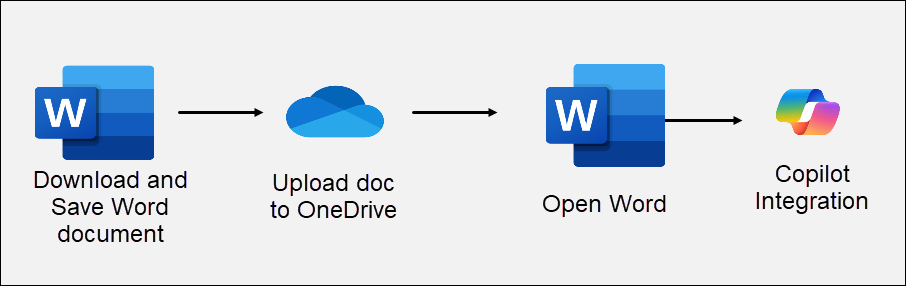
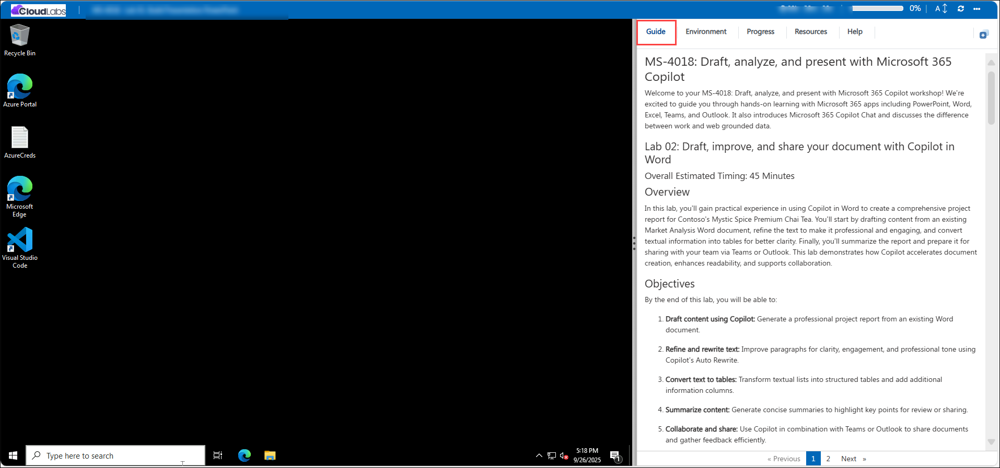

# MS-4018: Draft, analyse, and present with Microsoft 365 Copilot

Welcome to your MS-4018: Draft, analyse, and present with Microsoft 365 Copilot workshop! We’re excited to guide you through hands-on learning with Microsoft 365 apps including PowerPoint, Word, Excel, Teams, and Outlook. It also introduces Microsoft 365 Copilot Chat and discusses the difference between work and web grounded data.

## Lab 02: Draft, improve, and share your document with Copilot in Word

### Overall Estimated Timing: 45 Minutes

## Overview

In this lab, you’ll gain practical experience in using Copilot in Word to create a comprehensive project report for Contoso’s Mystic Spice Premium Chai Tea. You’ll start by drafting content from an existing Market Analysis Word document, refine the text to make it professional and engaging, and convert textual information into tables for better clarity. Finally, you’ll summarize the report and prepare it for sharing with your team via Teams or Outlook. This lab demonstrates how Copilot accelerates document creation, enhances readability, and supports collaboration.

## Objectives

By the end of this lab, you will be able to:

1. **Draft content using Copilot:** Generate a professional project report from an existing Word document.

1. **Refine and rewrite text:** Improve paragraphs for clarity, engagement, and professional tone using Copilot’s Auto Rewrite.

1. **Convert text to tables:** Transform textual lists into structured tables and add additional information columns.

1. **Summarize content:** Generate concise summaries to highlight key points for review or sharing.

1. **Collaborate and share:** Use Copilot in combination with Teams or Outlook to share documents and gather feedback efficiently.

## Pre-requisites

- Basic familiarity with Microsoft 365 Copilot and Word.

## Architecture / Workflow

The lab workflow demonstrates how Copilot in Word assists with drafting, refining, structuring, and sharing content:

- **Document Input:** Start with the Market Analysis Report Word document as the content source.

- **Copilot Drafting:** Use Copilot to generate a comprehensive project report including executive summary, introduction, and project objectives.

- **Content Refinement:** Improve paragraphs, rewrite sections, and add engagement or professional tone.

- **Text to Table Transformation:** Convert lists into tables, add columns for task completion, and enhance readability.

- **Summarization & Sharing:** Generate a summary of the report and share it via Teams or Outlook for collaboration.

## Architecture Diagram

## Explanation of Components

- **Word:** Core tool for creating, editing, and formatting text-based documents.

- **OneDrive**: It is Microsoft’s cloud storage service that lets you store, access, and share files securely from anywhere.

- **Copilot Integration:** AI-powered assistant embedded in Microsoft 365 apps to summarize content, generate visuals, analyse data, and draft professional text, enhancing productivity and collaboration.

# Getting Started with lab

Welcome to your Lab 02: Draft, Improve, and Share Your Document with Copilot in Word lab! We've prepared a seamless environment for you to explore and learn how to draft, refine, and collaborate on a project report using Copilot in Word. Let's begin by making the most of this experience:

## Accessing Your Lab Environment
 
Once you're ready to dive in, your virtual machine and **Guide** will be right at your fingertips within your web browser.
 

## Lab Guide Zoom In/Zoom Out
 
To adjust the zoom level for the environment page, click the **A↕: 100%** icon located next to the timer in the lab environment.

### Virtual Machine & Lab Guide
 
Your virtual machine is your workhorse throughout the workshop. The lab guide is your roadmap to success.

## Exploring Your Lab Resources
 
To get a better understanding of your lab resources and credentials, navigate to the **Environment** tab.
 

## Utilizing the Split Window Feature
 
For convenience, you can open the lab guide in a separate window by selecting the **Split Window** button from the Top right corner.
 

## Managing Your Virtual Machine
 
Feel free to **start, stop, or restart (2)** your virtual machine as needed from the **Resources (1)** tab. Your experience is in your hands!
 

## Lab Duration Extension

1. To extend the duration of the lab, kindly click the **Hourglass** icon in the top right corner of the lab environment. 

    

    >**Note:** You will get the **Hourglass** icon when 10 minutes are remaining in the lab.

2. Click **OK** to extend your lab duration.
 
    

3. If you have not extended the duration prior to when the lab is about to end, a pop-up will appear, giving you the option to extend. Click **OK** to proceed.

## Support Contact
 
The CloudLabs support team is available 24/7, 365 days a year, via email and live chat to ensure seamless assistance at any time. We offer dedicated support channels explicitly tailored for both learners and instructors, ensuring that all your needs are promptly and efficiently addressed.
 
Learner Support Contacts:
 
- Email Support: cloudlabs-support@spektrasystems.com
- Live Chat Support: https://cloudlabs.ai/labs-support

Click on **Next** from the lower right corner to move on to the next page.

   

## Happy Learning !!
