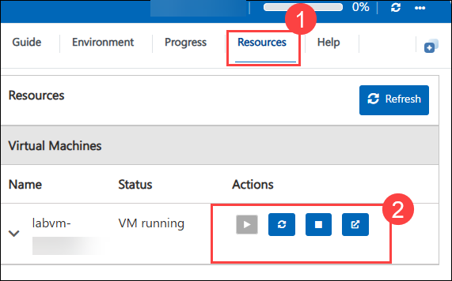
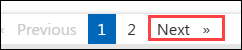

# MS-4018: Draft, analyze, and present with Microsoft 365 Copilot

Welcome to your MS-4018: Draft, analyze, and present with Microsoft 365 Copilot workshop! We’re excited to guide you through hands-on learning with Microsoft 365 apps including PowerPoint, Word, Excel, Teams, and Outlook. It also introduces Microsoft 365 Copilot Chat and discusses the difference between work and web grounded data.

## Lab 03: Manage collaboration from start to finish

### Overall Estimated Timing: 45 Minutes

## Overview

In this lab, you’ll use Copilot in Teams and Outlook to manage project-related communication for Contoso’s Contoso Connect product launch. You’ll start by drafting an engaging Teams message, refine it for tone and clarity, and collaborate with your team in real-time. Next, you’ll schedule a meeting in Outlook, leveraging Copilot to identify the optimal time and draft a professional invite. This lab demonstrates how Copilot accelerates communication, improves message quality, and facilitates efficient team collaboration.

## Objectives

By the end of this lab, you will be able to:

1. **Draft messages with Copilot:** Create professional and engaging messages in Teams to communicate ideas.

1. **Refine and adjust text:** Use Copilot to rewrite and adjust messages for clarity, tone, and engagement.

1. **Schedule meetings with Copilot:** Identify optimal times and draft professional meeting invites in Outlook.

1. **Collaborate efficiently:** Share messages and meeting invites to streamline team communication.

## Pre-requisites

- Basic familiarity with Microsoft 365 Copilot, Teams, and Outlook.

## Architecture / Workflow

The lab workflow demonstrates how Copilot in Teams and Outlook assists with drafting, refining, scheduling, and sharing content:

1. **Teams Message Drafting:** Create an initial message introducing your idea for the Contoso Connect launch.

1. **Message Refinement:** Use Copilot to rewrite and adjust for tone, clarity, and engagement.

1. **Outlook Meeting Scheduling:** Copilot suggests optimal times and drafts polished meeting invites.

1. **Collaboration & Sharing:** Share messages and meeting invites with the team for efficient project collaboration.

## Architecture Diagram

## Explanation of Components

- **Teams:** Central hub for team communication and collaborative discussion.

- **Outlook:** Tool for scheduling meetings, sending invites, and managing calendars.

# Getting Started with lab

Welcome to your Lab 03: Manage Collaboration from Start to Finish with Copilot lab! This lab provides a seamless environment for you to practice professional communication workflows with Teams and Outlook. Let’s get started:

## Accessing Your Lab Environment
 
Once you're ready to dive in, your virtual machine and **Guide** will be right at your fingertips within your web browser.
 

## Lab Guide Zoom In/Zoom Out
 
To adjust the zoom level for the environment page, click the **A↕: 100%** icon located next to the timer in the lab environment.

### Virtual Machine & Lab Guide
 
Your virtual machine is your workhorse throughout the workshop. The lab guide is your roadmap to success.

## Exploring Your Lab Resources
 
To get a better understanding of your lab resources and credentials, navigate to the **Environment** tab.
 

## Utilizing the Split Window Feature
 
For convenience, you can open the lab guide in a separate window by selecting the **Split Window** button from the Top right corner.
 

## Managing Your Virtual Machine
 
Feel free to **start, stop, or restart (2)** your virtual machine as needed from the **Resources (1)** tab. Your experience is in your hands!
 

## Lab Duration Extension

1. To extend the duration of the lab, kindly click the **Hourglass** icon in the top right corner of the lab environment. 

    

    >**Note:** You will get the **Hourglass** icon when 10 minutes are remaining in the lab.

2. Click **OK** to extend your lab duration.
 
    

3. If you have not extended the duration prior to when the lab is about to end, a pop-up will appear, giving you the option to extend. Click **OK** to proceed.

## Support Contact
 
The CloudLabs support team is available 24/7, 365 days a year, via email and live chat to ensure seamless assistance at any time. We offer dedicated support channels explicitly tailored for both learners and instructors, ensuring that all your needs are promptly and efficiently addressed.
 
Learner Support Contacts:
 
- Email Support: cloudlabs-support@spektrasystems.com
- Live Chat Support: https://cloudlabs.ai/labs-support

Click on **Next** from the lower right corner to move on to the next page.

   

## Happy Learning !!
