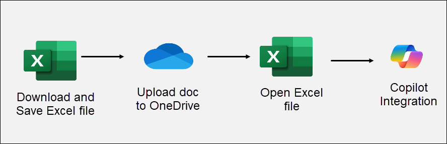
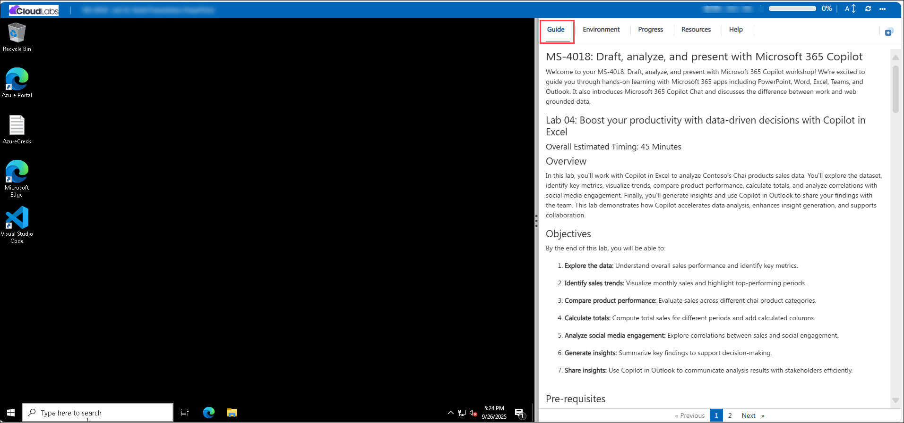

# MS-4018: Draft, analyse, and present with Microsoft 365 Copilot

Welcome to your MS-4018: Draft, analyse, and present with Microsoft 365 Copilot workshop! We’re excited to guide you through hands-on learning with Microsoft 365 apps including PowerPoint, Word, Excel, Teams, and Outlook. It also introduces Microsoft 365 Copilot Chat and discusses the difference between work and web grounded data.

## Lab 04: Boost your productivity with data-driven decisions with Copilot in Excel

### Overall Estimated Timing: 45 Minutes

## Overview

In this lab, you’ll work with Copilot in Excel to analyse Contoso’s Chai products sales data. You’ll explore the dataset, identify key metrics, visualize trends, compare product performance, calculate totals, and analyse correlations with social media engagement. Finally, you’ll generate insights and use Copilot in Outlook to share your findings with the team. This lab demonstrates how Copilot accelerates data analysis, enhances insight generation, and supports collaboration.

## Objectives

By the end of this lab, you will be able to:

1. **Explore the data:** Understand overall sales performance and identify key metrics.

1. **Identify sales trends:** Visualize monthly sales and highlight top-performing periods.

1. **Compare product performance:** Evaluate sales across different chai product categories.

1. **Calculate totals:** Compute total sales for different periods and add calculated columns.

1. **analyse social media engagement:** Explore correlations between sales and social engagement.

1. **Generate insights:** Summarize key findings to support decision-making.

1. **Share insights:** Use Copilot in Outlook to communicate analysis results with stakeholders efficiently.

## Pre-requisites

- Basic familiarity with Microsoft 365 Copilot, Excel, and Outlook.

## Architecture / Workflow

The lab workflow demonstrates how Copilot in Excel and Outlook assists with analyzing, visualizing, summarizing, and sharing data:

- **Excel Dataset Input:** Start with the Contoso Chai Tea sales data spreadsheet.

- **Data Exploration:** Use Copilot to summarize data and identify key metrics.

- **Trend Visualization:** Generate charts, highlight top months, and compare product sales.

- **Sales Calculation:** Compute totals and add relevant columns for analysis.

- **Correlation Analysis:** Identify relationships between sales and social media engagement.

- **Insights Generation:** Summarize analysis to extract actionable insights.

- **Sharing via Outlook:** Draft and refine professional emails with Copilot to communicate findings.

## Architecture Diagram

## Explanation of Components

- **Excel:** Core tool for data analysis, visualization, and calculation.

- **OneDrive**: It is Microsoft’s cloud storage service that lets you store, access, and share files securely from anywhere.

- **Outlook:** Platform for sharing insights and communicating results.

- **Copilot Integration:** AI assistant embedded in Excel and Outlook to summarize, visualize, analyse, and draft communications efficiently.

# Getting Started with lab

Welcome to Lab 04: Boost your productivity with data-driven decisions with Copilot in Excel! This lab provides a guided environment to explore Excel datasets, uncover insights, and communicate findings using Copilot. Let’s get started:

## Accessing Your Lab Environment
 
Once you're ready to dive in, your virtual machine and **Guide** will be right at your fingertips within your web browser.
 

## Lab Guide Zoom In/Zoom Out
 
To adjust the zoom level for the environment page, click the **A↕: 100%** icon located next to the timer in the lab environment.

### Virtual Machine & Lab Guide
 
Your virtual machine is your workhorse throughout the workshop. The lab guide is your roadmap to success.

## Exploring Your Lab Resources
 
To get a better understanding of your lab resources and credentials, navigate to the **Environment** tab.
 

## Utilizing the Split Window Feature
 
For convenience, you can open the lab guide in a separate window by selecting the **Split Window** button from the Top right corner.
 

## Managing Your Virtual Machine
 
Feel free to **start, stop, or restart (2)** your virtual machine as needed from the **Resources (1)** tab. Your experience is in your hands!
 

## Lab Duration Extension

1. To extend the duration of the lab, kindly click the **Hourglass** icon in the top right corner of the lab environment. 

    

    >**Note:** You will get the **Hourglass** icon when 10 minutes are remaining in the lab.

2. Click **OK** to extend your lab duration.
 
    

3. If you have not extended the duration prior to when the lab is about to end, a pop-up will appear, giving you the option to extend. Click **OK** to proceed.

## Support Contact
 
The CloudLabs support team is available 24/7, 365 days a year, via email and live chat to ensure seamless assistance at any time. We offer dedicated support channels explicitly tailored for both learners and instructors, ensuring that all your needs are promptly and efficiently addressed.
 
Learner Support Contacts:
 
- Email Support: cloudlabs-support@spektrasystems.com
- Live Chat Support: https://cloudlabs.ai/labs-support

Click on **Next** from the lower right corner to move on to the next page.

   

## Happy Learning !!

