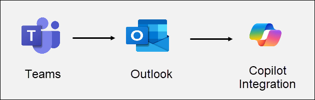
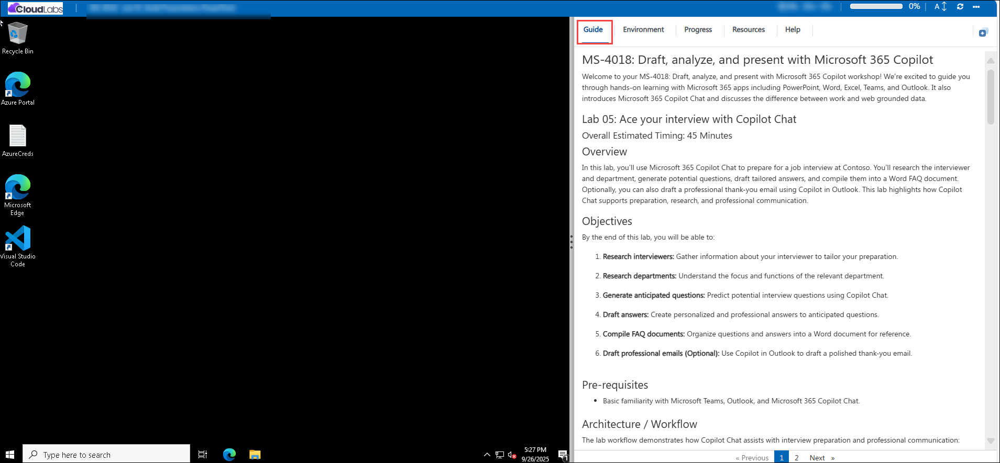

# MS-4018: Draft, analyse, and present with Microsoft 365 Copilot

Welcome to your MS-4018: Draft, analyse, and present with Microsoft 365 Copilot workshop! We’re excited to guide you through hands-on learning with Microsoft 365 apps including PowerPoint, Word, Excel, Teams, and Outlook. It also introduces Microsoft 365 Copilot Chat and discusses the difference between work and web grounded data.

## Lab 05: Ace your interview with Copilot Chat

### Overall Estimated Timing: 45 Minutes

## Overview

In this lab, you’ll use Microsoft 365 Copilot Chat to prepare for a job interview at Contoso. You’ll research the interviewer and department, generate potential questions, draft tailored answers, and compile them into a Word FAQ document. Optionally, you can also draft a professional thank-you email using Copilot in Outlook. This lab highlights how Copilot Chat supports preparation, research, and professional communication.

## Objectives

By the end of this lab, you will be able to:

1. **Research interviewers:** Gather information about your interviewer to tailor your preparation.

1. **Research departments:** Understand the focus and functions of the relevant department.

1. **Generate anticipated questions:** Predict potential interview questions using Copilot Chat.

1. **Draft answers:** Create personalized and professional answers to anticipated questions.

1. **Compile FAQ documents:** Organize questions and answers into a Word document for reference.

1. **Draft professional emails (Optional):** Use Copilot in Outlook to draft a polished thank-you email.

## Pre-requisites

- Basic familiarity with Microsoft Teams, Outlook, and Microsoft 365 Copilot Chat.

## Architecture / Workflow

The lab workflow demonstrates how Copilot Chat assists with interview preparation and professional communication:

- **Teams Copilot Chat:** Research interviewers and departments, generate questions, and draft answers.

- **FAQ Document Generation:** Compile questions and answers into a Word document for structured reference.

- **Optional Outlook Integration:** Draft a professional thank-you email to follow up after the interview.

- **Iterative Feedback:** Refine and adjust answers based on Copilot suggestions and personal preferences.

## Architecture Diagram

## Explanation of Components

- **Teams:** Platform for Copilot Chat interactions, research, and answer generation.

- **Outlook:** Tool to draft, refine, and send professional emails.

- **Copilot Chat:** AI assistant that contextualizes chat interactions to research, summarize, and draft professional content efficiently.

# Getting Started with lab

Welcome to Lab 05: Ace Your Interview with Copilot Chat! This lab provides a guided environment to explore how Copilot Chat can assist in interview preparation, research, and professional communication. Let’s get started:

# Getting Started with Ace your interview with Copilot Chat

Welcome to your Ace Your Interview with Copilot Chat lab! We've prepared a seamless environment for you to explore and learn how to prepare effectively for an interview, research your potential team, and draft strong responses to common questions using Copilot Chat. Let's begin by making the most of this experience:

## Accessing Your Lab Environment
 
Once you're ready to dive in, your virtual machine and **Guide** will be right at your fingertips within your web browser.
 

## Lab Guide Zoom In/Zoom Out
 
To adjust the zoom level for the environment page, click the **A↕: 100%** icon located next to the timer in the lab environment.

### Virtual Machine & Lab Guide
 
Your virtual machine is your workhorse throughout the workshop. The lab guide is your roadmap to success.

## Exploring Your Lab Resources
 
To get a better understanding of your lab resources and credentials, navigate to the **Environment** tab.
 

## Utilizing the Split Window Feature
 
For convenience, you can open the lab guide in a separate window by selecting the **Split Window** button from the Top right corner.
 

## Managing Your Virtual Machine
 
Feel free to **start, stop, or restart (2)** your virtual machine as needed from the **Resources (1)** tab. Your experience is in your hands!
 

## Lab Duration Extension

1. To extend the duration of the lab, kindly click the **Hourglass** icon in the top right corner of the lab environment. 

    

    >**Note:** You will get the **Hourglass** icon when 10 minutes are remaining in the lab.

2. Click **OK** to extend your lab duration.
 
    

3. If you have not extended the duration prior to when the lab is about to end, a pop-up will appear, giving you the option to extend. Click **OK** to proceed.

## Support Contact
 
The CloudLabs support team is available 24/7, 365 days a year, via email and live chat to ensure seamless assistance at any time. We offer dedicated support channels explicitly tailored for both learners and instructors, ensuring that all your needs are promptly and efficiently addressed.
 
Learner Support Contacts:
 
- Email Support: cloudlabs-support@spektrasystems.com
- Live Chat Support: https://cloudlabs.ai/labs-support

Click on **Next** from the lower right corner to move on to the next page.

   

## Happy Learning !!
